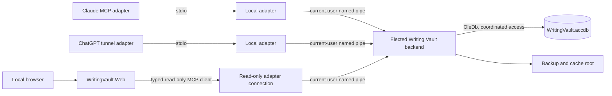

# Writing Vault v4 API and Read-Only Web Plan

Status: Phases 0 through 11 complete; Phase 12 remains open; real chat-client PNG ingress is a Phase 12 Release usability check  
Prepared: 2026-09-28  
Phase 0 accepted: 2026-09-28  
Current production surface: v3.0  
Related requirements: the curated [API feedback log](docs/API_FEEDBACK_LOG.md), [`temporal_aging.md`](temporal_aging.md), [`DESIGN_DECISIONS.md`](DESIGN_DECISIONS.md), and the [codebase cleanup plan](docs/CODEBASE_CLEANUP_PLAN.md). The original user-supplied `feedback.md` stays local and ignored until its repository disposition is reviewed.

## 1. Outcome

Version 4 will make the Vault easier for an AI writing assistant to use and will add a polished local web application for human browsing. The MCP API will keep continuity scope implicit after selection, use semantic references instead of database IDs, combine common editorial tasks, and return cohesive page-shaped reads. The web application will expose the same read model through attractive continuity, timeline, entity, source, and tag views.

The web application is read-only by construction. It will not open the Access database, register mutation tools, or expose application write endpoints. It will attach to the elected Writing Vault backend as a read-only client, so the backend remains the only database owner and Claude, ChatGPT, and the viewer can run at the same time.

Version 4 is complete only when:

- The common AI workflows in this plan are possible without numeric IDs, GUIDs, table knowledge, or avoidable lookup calls.
- Existing safety properties remain intact: selected-continuity isolation, idempotent mutations, optimistic concurrency, soft deletion, audit history, transactional invariants, verified migrations, and single-backend database ownership.
- The viewer presents every relevant record and relationship, renders notes safely as Markdown, and offers a useful graphical continuity timeline plus an accessible list alternative.
- The viewer cannot mutate the Vault even if its UI, routes, or requests are manipulated.
- Every implementation phase has passed its stated checks and a hostile review with zero unresolved issues.

## 2. Progress rules

This document is the v4 progress ledger. A checked implementation phase means its implementation, documentation, tests, and technical hostile review are complete. A feature that merely compiles or has a happy-path demonstration stays unchecked. The user has deferred the Phase 9 and 10 visual inspections to one end-of-development review after both layers are built; visual acceptance is therefore a Phase 11 gate before Release cutover.

The Phase 9/10 findings below extend the already published Debug read surface. Earlier checked phases record the scope that passed at the time; they do not certify a later contract revision. Regenerate the v4 snapshots, rerun protocol and compatibility checks, and record a new zero-finding contract review before Phase 11 closes. At the user's request on 2026-09-30, real PNG ingress from ChatGPT and Claude moved from the pre-Release Phase 1 gate to Phase 12 Release usability validation; any defect found there must be fixed before Phase 12 closes, but it does not block the switch-over.

On 2026-09-30, after the Phase 11 Debug build passed 208/208 tests and the loaded-browser technical regression passed, the user explicitly directed full Phase 12 work and a good Release build before processing her queued visual comments. This superseded the earlier visual-acceptance-before-Release sequencing. Her subsequent GUI refinements were implemented, and she accepted the viewer as presented for the Phase 11 visual gate. The final hostile review then closed with zero unresolved findings. She waived the actual Narrator walkthrough, recorded separately from the passing automated and keyboard checks.

- [x] The v4 plan has been prepared from the v3 implementation and the current feedback log.
- [x] Phase 0 - approve and record the v4 decisions
- [x] Phase 1 - freeze contracts and compatibility fixtures
- [x] Phase 2 - add v4 storage and migration support
- [x] Phase 3 - build semantic resolution and common application services
- [x] Phase 4 - build the cohesive read model and search
- [x] Phase 5 - implement temporal aging
- [x] Phase 6 - implement managed entity images
- [x] Phase 7 - publish and validate the v4 MCP surface
- [x] Phase 8 - establish the read-only web host and visual system
- [x] Phase 9 - implement continuity and record pages
- [x] Phase 10 - implement the graphical timeline
- [x] Phase 11 - harden security, accessibility, capacity, recovery, and repository readiness
- [ ] Phase 12 - cut over production and complete usability acceptance

## 3. Accepted Phase 0 decisions

These choices were accepted in Phase 0 and are recorded in `DESIGN_DECISIONS.md` sections 15–23.

### 3.1 One backend and one source of truth

The existing elected backend remains the only process that opens the `.accdb` for application use. The MCP stdio adapters and the web viewer are clients of that backend over the current-user named pipe. The viewer never opens the database directly, even for reads. This keeps process coordination, schema checks, integrity checks, and Access locking behavior in one place.

### 3.2 The viewer consumes the public v4 read contract

The web project will use a typed v4 client over a read-only MCP stream connection. It will not add a second private SQL/query API. This makes the viewer exercise the same semantic references, paging, scoping, and projections given to Claude and ChatGPT.

Each browser session or interactive circuit gets a scoped read-only backend connection. Its selected continuity and optional artificial-time override are independent of every other browser tab and MCP client. The continuity is also present in the route, so reconnecting can restore the session deterministically.

### 3.3 v3 compatibility during construction

v3 remains the production default while v4 is incomplete. Development builds can select `--tool-surface v3` or `--tool-surface v4`; the backend and database schema support both during the transition. The named-pipe handshake will carry the requested surface and the server will reject an unsupported version explicitly. At cutover, v4 becomes the default and v3 remains an explicit fallback for one release cycle. The server will never advertise a mixed, ambiguous v3/v4 contract on one connection.

### 3.4 Cohesive reads, guarded specialized writes

v4 adds a small group of task-oriented reads and common writes. Specialized mutations remain when they enforce important temporal or relational invariants, such as transferring ownership, transitioning residence, or adding a reciprocal character relationship. Tool count is not reduced by merging unrelated actions into an unsafe generic command.

### 3.5 Name resolution never guesses

An opaque semantic reference is authoritative. A natural name can be used where it is convenient, but only when it resolves to exactly one allowed target in the selected continuity and context. Zero matches return `record.not_found`. Multiple matches return `record.ambiguous` with a small set of labelled candidates and perform no mutation.

Continuities remain selected by exact name. Internal numeric IDs, Access keys, operation GUIDs, pipe names, and database paths never appear in MCP or web responses.

### 3.6 Fictional time stays separate from real audit time

The story timeline contains fictional dates and periods. Database changes, source retrievals, and backup timestamps remain a separate real-UTC activity/history view. The web UI never mixes the two onto one chronological axis.

Story dates remain timezone-free. The selected continuity clock or per-client override carries the reference timezone used to interpret the artificial current time. A per-client override may be an exact instant or a whole local date; date-only results must preserve a day-wide range rather than invent an hour. If neither is set, time-dependent reads return `TimelineUnset`; they never substitute the computer clock.

### 3.7 Markdown is data, not executable content

Notes store Markdown source. The viewer renders a documented CommonMark subset with raw HTML disabled and sanitizes the result again before display. Scripts, event attributes, unsafe URL schemes, embedded frames, and automatic remote image fetches are forbidden. A collapsible read-only source view preserves exact Markdown text.

### 3.8 Managed images favor safe viewing copies

The Vault stores bounded JPEG display and thumbnail renditions plus metadata and hashes in Access. It does not use the Access complex `Attachment` column type, which is awkward to manage safely through OleDb. Uploaded originals are retained as immutable content-addressed files under a configured companion asset root, which defaults beneath the existing OneDrive-backed backup root. Access stores the relative path and SHA-256 hash. An original can be recovered even if conversion loses detail, while ordinary pages and MCP image views use only the bounded Access renditions.

Initial limits will be confirmed with representative images before Phase 6 is closed. The proposed starting policy is a 20 MB input ceiling, a display rendition no larger than 2048 pixels on its longest edge and 5 MB, and a thumbnail no larger than 512 pixels and 512 KB. The existing database warning and hard size ceilings remain in force.

### 3.9 The first web release is local and read-only

`WritingVault.Web` binds to loopback by default, loads no third-party fonts, scripts, analytics, or remote images, and has no application mutation service. The backend also records the connection capability and rejects mutation dispatch for a read-only connection even if a caller fabricates a tool request. LAN hosting, accounts, authentication, editing, uploads, and public deployment are later projects requiring a separate threat model.

The default viewer address is `http://127.0.0.1:5284`, with an explicit configuration override. Host and Origin validation, disabled CORS, same-origin browser state, and a strict content-security policy protect the local surface from cross-origin and DNS-rebinding access. The configured address is literal: a port conflict produces an actionable startup failure in status and logs. The viewer never falls back to another port and never breaks a bookmark silently.

### 3.10 Visible data has an explicit freshness contract

Every page-shaped read returns an opaque observed revision. A dedicated read-only watcher connection calls bounded `changes_since({ cursor, waitSeconds })`; the backend completes the call immediately after a relevant transaction commits or returns a heartbeat at the timeout. Starting from the revision returned with the page prevents a race between initial rendering and change watching.

When a change arrives, the viewer immediately marks affected visible sections as updating, requeries them, and advances its applied revision only after the replacement data renders. A change that cannot be mapped precisely invalidates the entire visible page and timeline viewport. Cursor expiry, backend restart, watcher failure, or browser reconnection triggers a full visible-page refresh.

The UI shows **Live** only while the watcher is connected and its applied revision has caught up. A failed or delayed watcher shows a persistent **Updates paused - displayed data may be stale** banner with the last successful refresh time and retry state. Returning to a hidden or disconnected tab performs catch-up before the page returns to Live. Stale data is never silently presented as current.

### 3.11 Companion assets are recoverable but not browsed directly

Image masters and source snapshot files use immutable content-addressed paths. File creation uses a temporary file, hash verification, and atomic rename before the Access transaction records the relative path. A failed database transaction may leave an unreferenced immutable file; maintenance can report and safely collect it after a retention window. A missing or hash-mismatched referenced file is an integrity issue. Verified backups include an asset manifest and validate every referenced hash.

### 3.12 Windows startup is current-user, hidden, and recoverable

The supported startup mode uses two current-user Windows Scheduled Tasks triggered at logon: one for `WritingVault.Web` and one for the ChatGPT MCP tunnel. A Windows service is not used because the named-pipe boundary, tunnel credential, browser session, and DPAPI-protected API key all belong to the interactive Windows user.

The web task serves the fixed bookmarkable address `http://127.0.0.1:5284` and does not open a browser at every logon. The tunnel task uses the existing encrypted credential and profile without prompting, does not open its administration UI, and never places the API key in task arguments, environment persisted outside the child process, or task XML. Both tasks run without visible console windows, use bounded logs under `%LOCALAPPDATA%\WritingVaultMCP\Logs`, and supervise their own restart/backoff independently. A web crash does not restart or disconnect the tunnel; a tunnel crash does not restart or interrupt the viewer. Only an explicit maintenance stop/restart coordinates both.

A root `Configure-WritingVault-Startup.bat` and PowerShell implementation provide `install`, `status`, `start`, `stop`, `restart`, and `remove`. Installation validates the release artifacts, production database, tunnel profile, decryptable saved key, and web port before changing Task Scheduler. Stop/restart operations coordinate both tasks so database migration, backup restore, and other maintenance can obtain a fully closed database. Startup never runs migrations automatically.

## 4. Target architecture



The solution will be split into projects or assemblies with explicit dependency direction:

| Component | Responsibility |
| --- | --- |
| `WritingVault.Domain` | Story dates, entities, relationships, temporal-age rules, and invariant-bearing value types |
| `WritingVault.Application` | Transport-neutral commands, queries, projections, reference resolution, and authorization-free single-user policy |
| `WritingVault.Infrastructure.Access` | OleDb repositories, migrations, transactions, integrity checks, image persistence, and timeline query implementation |
| `WritingVault.Mcp` | v3/v4 MCP schemas, session state, tool descriptions, and error mapping |
| `WritingVault.Client` | Typed read-only v4 client and backend connection/bootstrap logic shared by UI hosts |
| `WritingVault.Web` | ASP.NET Core Blazor web application, local navigation, Markdown rendering, and SVG timeline |

The exact project extraction can be incremental. The required boundary is that web components depend on typed read contracts and never on OleDb classes or write services.

## 5. v4 contract principles

### 5.1 Scope and session

- `session_set({ continuityName, currentTime?, currentDate?, referenceTimeZoneId? })` selects continuity and optionally sets the connection-local clock in one call. `currentTime` and `currentDate` are mutually exclusive.
- `session_get()` reports the selected continuity name, the effective time, whether it comes from the session or continuity clock, and the reference timezone.
- Clearing a time override is explicit and leaves the continuity selected.
- All continuity-scoped calls use the selected continuity implicitly.
- A missing selection returns one stable error with the exact recovery path: `continuity_list` then `session_set`.
- A session response includes no storage identity.

The separate v3 session calls can remain as compatibility aliases during the transition, but v4 documentation leads with `session_set`.

### 5.2 References

Every externally addressable record other than a continuity uses a stable semantic reference. A continuity keeps its unique exact name as its public identity. Record responses contain:

- `ref`: opaque semantic reference.
- `kind`: human-readable record kind.
- `name` or `title`: display label.
- `context`: enough short text to distinguish candidates.
- `version`: only where optimistic concurrency or history inspection makes it useful.

No public value may expose an Access row key, AutoNumber, database GUID, internal operation GUID, or disguised storage identity. Meaningful domain identifiers such as `referenceTimeZoneId` and `calendarId` are allowed because their values are public standards rather than database keys. Contract tests inspect serialized JSON and generated tool schemas using an explicit domain-identifier allowlist instead of rejecting every `...Id` suffix.

### 5.3 Dates

Inputs accept a compact form for ordinary cases and a rich form for uncertainty:

```json
"2026-09-28"
```

```json
{ "kind": "Year", "value": "2026" }
```

```json
{
  "kind": "Circa",
  "lower": "2026-03-01",
  "upper": "2026-05-31"
}
```

The server normalizes every accepted form into the existing story-date model and returns both structured bounds and a display label. Omitted fields mean unchanged in a patch; explicit `null` clears a nullable field. Date parsing never uses machine locale.

### 5.4 Paging and page-shaped reads

All unbounded collections use opaque keyset cursors. A page has this common shape:

```json
{
  "items": [],
  "nextCursor": null,
  "hasMore": false
}
```

`get` can include several bounded sections for first paint. Each section has its own cursor and `hasMore`, so a clipped notes section does not hide whether events or relationships were clipped. `list_related` pages one named section without returning the full overview again.

### 5.5 Errors

Errors use stable codes, a useful message, and structured recovery data where applicable. Required codes include:

- `session.continuity_required`
- `record.not_found`
- `record.ambiguous`
- `reference.invalid`
- `reference.type_invalid`
- `scope.mismatch`
- `version.conflict`
- `date.invalid`
- `timeline.unset`
- `timeline.conflict`
- `page.cursor_invalid`
- `image.too_large`
- `image.unsupported`
- `read_only`

An `INVALID_ARGUMENT` without field-level detail is not an acceptable v4 response.

### 5.6 Mutation safety

Every mutation keeps a readable, vault-wide idempotency token and an expected version when it modifies an existing versioned record. The common top-level field will be named `mutationToken` across all v4 write tools. It is transport metadata but remains explicit until every supported MCP host provides a retry identity that is stable across uncertain retries and reconnects. The backend continues to derive its internal operation identity and never returns the internal GUID.

Successful mutations return the affected semantic references, new versions, a compact change summary, and enough context for the next action. Atomic task-level tools journal their constituent changes under one operation.

## 6. Proposed v4 tool families

The exact generated schemas are frozen in Phase 1. This is the intended public shape.

### 6.1 Session and health

| Tool | Purpose |
| --- | --- |
| `vault_health` | Schema, integrity, pending writes, supported surface, image/storage capacity bands, and latest verified backup without paths |
| `continuity_list` | Continuity names, descriptions, deletion state, and clock summaries |
| `session_set` | Select continuity and optionally set or clear the per-connection artificial time |
| `session_get` | Return selected continuity and effective clock provenance |
| `vault_backup_create` | Create and verify an idempotent regular database and companion-asset backup in the configured root without accepting or exposing paths |

### 6.2 Cohesive reads

| Tool | Purpose |
| --- | --- |
| `search` | Search across selected types, aliases, tags, and summaries in the selected continuity |
| `get` | Fetch the selected continuity when `ref` is omitted, or fetch an entity, source, tag, note, image, claim, or relationship overview by semantic reference |
| `list_related` | Page one relation or collection belonging to a record |
| `timeline_get` | Query story timeline items for a viewport, filters, lanes, and optional focus records |
| `tag_targets` | Browse all selected-continuity records carrying a tag, across types |
| `history_get` | Read real-UTC change history separately from story chronology |
| `changes_since` | Poll an opaque change cursor so read-only companions can invalidate visible records after writes |
| `character_age` | Return calendar, legal, biological, and experienced age at the effective time or a supplied hypothetical `at` |
| `temporal_effect_preview` | Validate a proposed effect and calculate its hypothetical age outcome without writing |
| `image_list` | Page image metadata for a target or continuity |
| `image_search` | Search image metadata without transferring image bytes |
| `image_view` | Return one bounded thumbnail or display rendition as MCP image content |

`search` returns typed summaries only. It does not silently include large graphs, notes, Markdown HTML, history JSON, or image bytes.

### 6.3 Common editorial writes

| Tool | Purpose |
| --- | --- |
| `entity_create` | Create one of the six canon entity types with type-specific fields |
| `entity_update` | Apply a sparse validated patch by semantic reference |
| `note_add` / `note_update` | Manage Markdown notes on an entity or continuity |
| `tag_apply` | Atomically add or remove one tag from several mixed target types |
| `event_record` | Create one world event and atomically connect participants, locations, projects, and optional entity-specific impacts |
| `image_attach` / `image_update` | Convert, store, describe, designate, delete, or restore entity images |

### 6.4 Specialized invariant-bearing writes

The v4 surface retains clear operations for:

- Continuity creation, update, shared clock setting, deletion, and restore.
- Variant grouping and cross-continuity duplication.
- Source, snapshot, claim, and provenance management.
- Character aliases, residence transitions, temporal profiles, and temporal effects.
- Relationship type management, continuity-scoped relationship identities with 2–100 characters, and repeatable membership periods for each character. The group shares one undirected type; existing directed types remain two-person relationships.
- `relationship_create` accepts the shared type and a list of distinct character references; `relationship_membership_period_add` adds one dated or uncertain participation period to one member, allowing independent exits and re-entries. Both use semantic references, mutation tokens, and version checks. Relationship-level active intervals are derived from membership rather than entered redundantly.
- `relationship_event_add` for events owned by the relationship identity, with fuzzy date, optional world-event context, and optional project associations. The existing event/project operation must accept relationship events too.
- Organization aliases, membership transitions, and location periods. Organization and relationship membership joins and leaves have independently fuzzy story dates and optional transition-specific descriptions. A missing description falls back to the natural-language entry or exit sentence; clearing it restores that fallback.
- Object ownership, co-owner replacement, transfers, custody, and location periods.
- World-event participant and location changes that do not require creating a new event.
- `event_project_apply`, which atomically adds or removes project associations for a world event, entity-specific event, or relationship event. Zero associations remain valid. Relationship-event support is implemented in the Debug candidate and remains under Phase 11 hostile review.
- Soft-delete preview, soft deletion, and restore.

These tools will share argument names, date forms, target resolution, mutation tokens, version checks, result envelopes, and error codes. Permanent purge and schema migration remain administrative CLI operations.

## 7. Read model

### 7.1 Universal search

`search` supports text, record kinds, tags, projects, deletion state, and bounded paging. It searches names, preferred names, aliases, titles, short descriptions, and tag names. Results clearly distinguish continuity-scoped canon from vault-global sources.

Search resolution and search discovery are different operations. A write may resolve a supplied natural name only when exactly one result is valid; it never chooses the first full-text hit.

### 7.2 Change awareness

`changes_since({ cursor, waitSeconds? })` returns a new opaque cursor and compact semantic references for records changed after the cursor. With a bounded wait it returns as soon as a relevant committed change is available or emits a heartbeat when the wait expires. It includes canon changes from the selected continuity and all changed vault-global sources and tags, because those global records may be visible on the current page. It may indicate that the selected continuity or its timeline changed when a specific public reference is not available. It contains no story text, internal sequence number, database key, operation GUID, or path.

Every page-shaped read includes the revision observed by that read. The viewer starts or resumes watching from that revision, so a commit between the read and watcher call is returned immediately rather than missed. The backend signals watchers only after the database transaction and its change-log rows commit.

The viewer uses this bounded read-only feed to invalidate its currently visible overview, relation sections, search counts, source/tag components, and timeline viewport after writes from Claude, ChatGPT, or another adapter. Reconnect resumes from the last cursor; an expired cursor requests one full refresh and establishes a new cursor. A dedicated watcher connection keeps the wait from blocking ordinary page reads and adds no browser-accessible write channel.

### 7.3 Record overview

`get({ ref?, include, limits })` returns a shared header and selected sections. Omitting `ref` returns the selected continuity; other records use their semantic reference. Supported sections include:

- Core fields and deletion state.
- Notes, rendered only by presentation clients.
- Story events and dated periods.
- Relationships and reverse relationships.
- Tags and projects.
- Sources, claims, and provenance.
- Images and the primary image.
- Current temporal state at the effective artificial time.
- Type-specific information.
- A compact real-UTC history preview.

The default include set stays small enough for MCP use. The web client requests the sections needed for a page and follows per-section cursors lazily.

### 7.4 Relevant record kinds

The API and viewer cover:

- Continuities.
- Projects.
- Locations.
- Characters.
- Organizations.
- Objects.
- World events, entity-specific events, and relationship events (the latter implemented in the Debug candidate and still under Phase 11 review).
- Sources and snapshots.
- Claims and evidence links.
- Tags.
- Notes.
- Images.
- Variant groups.
- Character relationships and relationship types.
- Residence, membership, organization-location, ownership, custody, and object-location periods.
- Change history and deleted records.

Processed-operation records, internal ownership-principal keys, schema metadata, and storage diagnostics remain implementation details. An external or collective ownership principal appears through its meaningful owner label or linked entity.

## 8. Story timeline contract

`timeline_get` supports two coordinated read patterns: a bounded, optionally aggregated graphical viewport and an independently paged detail stream for the complete filtered chronology table. The table calls `timeline_get` with `resolution: Detail`, without graph viewport bounds; it supplies `from`/`to` only while an explicit date selection is active. Inputs include optional `from`, `to`, lane kinds, entity kinds, focused record references, tags, projects, locations, free text, undated inclusion, cursor, and limit. Ordinary graph pan and zoom change only the graphical viewport. Clearing an explicit range restores the complete non-date-filtered detail stream. Project filters include world, entity-specific, and relationship events through their associations once the Phase 11 relationship-event amendment lands. Entity-kind filters distinguish world events and Character, Location, Organization, and Object events even when they share the entity-event lane; relationship events get a separate selectable kind. Focused record references select individual entities or relationships by semantic reference and include timeline items owned by or directly related to any selected record. The client must detect an observed-revision change across detail pages and restart that stream rather than present a partial mixed-revision table as complete.

The query does not require an artificial clock. Stored historical events and ranges render normally when the selected continuity clock is unset. In that state the result reports that no effective current time exists, omits the current-story-time marker, and leaves only genuinely time-dependent projections such as age or “currently active” relations unavailable.

Each returned timeline item contains:

- Its semantic `ref`, kind, title, short summary, and related record summaries.
- Structured story-date bounds, display label, precision, uncertainty kind, and open-ended flags.
- A display start and end that do not invent precision beyond the stored bounds.
- Lane and visual category.
- Narrative order where present.
- Current/deleted state and warnings.
- Optional continuation cursor or aggregate count.

The detail projection must carry every relevant semantic entity reference in `related` and every project association in a `projects` collection, including world-event participants, locations, entity-event owners, and event-project links. One event appears once even when several selected entities or projects match it. Display labels, project membership, and entity-wide highlighting must derive from that complete association set; the current single-related-entity projection is insufficient.

Timeline lanes draw from authoritative source records rather than a duplicated timeline table:

| Lane | Data |
| --- | --- |
| World events | World-event date/range, locations, participants, impact, and outcome summaries |
| Entity events | Character, location, organization, and object events, including optional project associations |
| Characters | Birth/death markers or lifespan ranges, plus focused character events |
| Relationships | Shared relationship identity, participants, each character's repeatable enter/exit periods, and reciprocal labels for legacy directed pairs |
| Residence | Character residence periods |
| Organizations | Membership and organization-location periods |
| Objects | Ownership, custody, and location periods |
| Temporal effects | Personal aging effects and their rates |

Source retrieval timestamps, record creation times, and change-log entries do not appear here. Undated story records appear in a separate “Undated” collection so they are discoverable without being placed at a fake date.

The graphical viewport and the integrated chronology table use the same filter model. With no explicit date selection, the table pages through the complete filtered chronology rather than silently limiting itself to the current pan/zoom viewport. Brushing or otherwise selecting a date range in the graph temporarily restricts the table to items whose possible date bounds overlap that range; clearing the range restores the complete chronology under the remaining filters. Ordinary pan and zoom do not filter the table. The table combines world events with Character, Location, Organization, and Object events in one ordered stream, emits one row per event even when several selected entities are related to it, and lists every matching entity on that row. Other temporal lanes such as lifespans, relationships, residence, membership, ownership, custody, location, and aging effects can be included through the lane controls.

Chronology date presentation follows a Year / Month / Day or period rhythm. For precise Gregorian entries, repeat a year, month, or day only when that component changes from the preceding visible row, as in a writer's event ledger. A page starts with fresh date context; same-day timed entries retain their time. Year/month-only entries never invent missing precision. Circa dates, open-ended dates, and unsplit single-day ranges use one full-width date cell with the readable period and duration rather than pretending that a lower or upper bound is the event's exact day. Every row retains its complete date for screen readers.

For multi-day bounded Gregorian ranges, the optional `timeline_get({ resolution: "Detail", expandRanges: true })` projection emits a start and end occurrence with one semantic event reference and their own boundary dates, sorted and paged among other events. The viewer uses that projection for the integrated table only; the graph and ordinary API reads continue to treat the event as one record. The start row carries the full description, related records, original date wording, and duration; the end row says which event ended. A left-gutter connector uses separate tracks for overlapping ranges, with a right-pointing start arrow and left-pointing end arrow. When a pair crosses a page boundary, the track reaches the edge and the row says its counterpart is elsewhere. Same-day ranges, circa dates, open bounds, and non-Gregorian dates remain single rows. A selected date window wholly inside a range shows one `Ongoing` context row, keeping the window's table accurate without inventing a boundary.

Fuzzy dates remain visible:

- Exact dates render as markers.
- Closed ranges render as bars.
- Year or month precision renders as a bounded band.
- Before/after and open ranges use directional edges.
- Approximate or uncertain bounds use a distinct edge and texture treatment.
- An item with only narrative order can appear in narrative mode, not at an invented calendar position.

## 9. Read-only web application

### 9.1 Host and connection behavior

`WritingVault.Web` is an ASP.NET Core application with a browser-native shell and local JavaScript interactivity for search, filters, and the timeline. It starts or joins the existing backend through reusable client/bootstrap code and handshakes with `ReadOnly = true`. The backend advertises read tools only for that connection.

The default URL is loopback-only. A launcher prints and optionally opens the local address, reports the selected database by friendly configuration name rather than full path, and shuts down cleanly. The backend reference count keeps working: the backend remains alive while any MCP adapter or viewer connection exists and exits after the final connection closes.

When Windows startup is enabled, the persistent web connection normally keeps the elected backend alive for the user’s logged-on session. The tunnel and web tasks may start in either order: backend election handles the race, and each client retries transient startup or network failures without creating a duplicate backend or tunnel profile instance.

Application code exposes only `IVaultReadClient`. No web project references a command service, OleDb repository, schema migrator, purge service, or backup writer. Automated architecture tests enforce these dependency rules.

### 9.2 Navigation

The desktop layout uses a calm three-part structure:

- A persistent left rail for continuity, home, timeline, search, entity kinds, sources, tags, and deleted records.
- A top bar for continuity switching, universal search, effective story time, theme, and compact session status.
- A wide content area with breadcrumbs and an optional contextual details drawer.

Small screens collapse the rail into a navigation sheet and replace multi-column layouts with a single readable stream. Timeline controls remain reachable without covering the graph.

Routes are bookmarkable and carry the continuity plus semantic record reference. Filters, focused records, viewport bounds, and timeline mode are represented in the query string where practical. A reconnect restores the route’s continuity before issuing scoped reads.

Proposed route families:

```text
/
/c/{continuity}/overview
/c/{continuity}/timeline
/c/{continuity}/search
/c/{continuity}/{kind}/{reference}
/c/{continuity}/tags/{reference}
/sources/{reference}
/c/{continuity}/deleted
```

### 9.3 Visual direction

The UI should feel like a writer’s reference library rather than a database administration console. It will use a restrained type scale, comfortable reading width, strong page hierarchy, quiet surfaces, and entity-type accents that remain legible in light and dark themes. Dense relationship material uses cards, chips, chronology rails, and tables only where those forms improve scanning.

The visual system includes:

- Local system fonts and no third-party tracking or asset requests.
- Shared spacing, typography, elevation, radius, focus, color, and timeline tokens.
- Light, dark, and system themes.
- Skeletons and progressive section loading without layout jumps.
- Useful empty states that explain whether a filter, missing clock, or genuinely absent data caused the result.
- Consistent icons and labels for all six canon entity types and supporting records.
- Reduced-motion behavior and no information encoded by color alone.

### 9.4 Continuity home

The continuity page shows:

- Name, description, timezone, effective artificial time, and clock provenance.
- Markdown continuity notes and linked sources.
- Counts by entity type, event/date coverage, and deleted-record counts.
- Featured or primary entities and recently changed records.
- A compact timeline preview around the effective story time.
- Tags, projects, unresolved claims, undated items, and data-quality warnings.

The page never exposes numeric IDs or an Access-centric table view.

### 9.5 Shared entity page

Every canon entity page has a consistent shell:

- Header with type, name, aliases, status, tags, project membership, primary image, and semantic-link actions.
- Overview fields and rich description.
- Markdown notes with title, provenance, source links, and a read-only raw-source disclosure.
- Images with captions, roles, canon status, source, accessible alt text, and a gallery/lightbox.
- Story events and a focused timeline.
- Relationships in both directions with meaningful inverse labels.
- Sources, claims, evidence locators, and cached-snapshot status.
- Current temporal state at the session time.
- Real-UTC record history in a clearly separate activity section.
- Per-section paging, deleted-state badges, and links to related pages.

The header provides separate **Copy page link** and **Copy Vault reference** actions. The reference copy includes the visible label, kind, continuity name, and opaque semantic reference in a short human-readable block. A user can paste that block into chat to identify the exact record without assuming the assistant can see the browser.

### 9.6 Type-specific pages

| Page | Additional content |
| --- | --- |
| Character | Preferred/full names, pronouns, species and identity fields, birth/death, birthplace, four age categories, applied temporal effects, residences, memberships, reciprocal relationships and their events, possessions/custody, own events, and participation in world events |
| Location | Parent breadcrumb, child locations, timezone, residents, organizations, objects, world events, and location history |
| Organization | Aliases, members and roles over time, locations over time, related events, objects, and claims |
| Object | Ownership shares and transfers, custody, location history, participants, related events, and provenance |
| World event | Fuzzy date/range, narrative order, description, locations, participants, impacts, outcomes, projects, entity-specific and relationship-event links, sources, and claims |
| Project | Description, member entities grouped by type and role, associated world, entity-specific, and relationship events, project-filtered timeline, sources, tags, and related notes |

Supporting pages include:

- **Source:** URL and archive link, citation, author/publisher, retrieval state, snapshot metadata, tags, claims, notes, and linked entities. External links show their hostname and open explicitly; the viewer never refreshes a source automatically.
- **Claim:** Claim text, status, confidence, target field, commentary, linked entities, relationships or notes, and each supporting or contradicting source with snapshot and locator details.
- **Tag:** Description and paged targets across record types, with type and project filters.
- **Variant group:** Variants grouped by continuity with direct links.
- **Reference data:** Human-readable relationship types and other small catalog values used by the visible records.
- **Deleted records:** Searchable read-only view with deletion state and history; no restore button in the viewer.
- **Relationship:** Shared type and Markdown notes, all 2–100 participants, each member's repeatable periods and entry/exit chronology, derived group active intervals, and a paged event section. Directed two-person records retain reciprocal labels. Each relationship event has its own page with date, description, optional world-event and project links, all participants, and real change history.

### 9.7 Global timeline experience

Phase 11 visual-review amendment: the graphical view opens in **Combined** layout by default. Every enabled dated world event, entity event, and other temporal record shares one horizontal time axis; overlapping marks may stack vertically within that one chronology, but record types do not begin in separate lanes. An optional **Grouped** layout restores lanes by record type, with entity-focused grouping available when useful. The layout choice changes presentation only: both layouts retain the same filters, semantic references, date-range selection, table rows, undated collection, and unset-clock behavior. Preserve the choice in the timeline URL. The user selected a TimelineJS-inspired card-and-ruler style with colors complementary to the Vault theme on 2026-09-29. Both Combined and Grouped layouts are implemented in Debug; the user accepted the viewer as presented for Phase 11 on 2026-09-30.

Relationship events join that chronology as one item per event, with every participant and the owning relationship in the related-reference set. Any participant's filter and highlight must find the same item. The integrated table includes these events alongside world and entity events; its type filters can independently include or exclude relationship events. Undated relationship events remain in the Undated collection. Optional project and world-event links participate in the same project/context filters as other events.

Visual references for that review: [Aeon Timeline's compact and grouped displays](https://www.aeontimeline.com/features/interactive-timeline-software) for readable event cards and uncertain dates; [Vis Timeline examples](https://visjs.github.io/vis-timeline/examples/timeline/) for dense-item stacking, range marks, and pan/zoom behavior; and [TimelineJS](https://timeline.knightlab.com/) for focused story presentation. Use these as interaction and visual references rather than assuming a library replacement.

The continuity timeline is a full-width interactive SVG view with:

- Horizontal pan and zoom plus typed date-range controls.
- A minimap/range brush for rapid navigation.
- Lane selection, entity-type filters, tags, projects, locations, and focused records.
- A vertical effective-story-time line with its timezone label and clock provenance when a session or continuity clock is set; otherwise a compact “story time unset” status with no invented marker.
- Markers, range bars, density clusters, uncertainty styling, and a clear legend.
- Hover/focus summaries and a keyboard-operable details drawer linking to full pages.
- Calendar-order and narrative-order modes with an explicit label when switching models.
- URL-persisted viewport and filters for bookmarking.
- Lazy viewport queries and aggregation when too many items would overlap.
- An “Undated” drawer and warnings for missing or conflicting temporal data.
- A synchronized chronology table directly beneath the graph. Its core columns are **Year**, **Month**, **Day or range**, **Event**, **Event type**, **Related entities**, and **Project(s)**. Repeated dates may be visually grouped like a writer-maintained chronology, but every row retains a complete accessible date label.
- Event-type checkboxes for World events, relationship events, and Character, Location, Organization, and Object events, plus a searchable individual-entity selector grouped by type. Types and individual entities can be selected or deselected independently; the graph, table, counts, URL state, and Undated collection always apply the same selection.
- Clickable entity links and chips in the graph, table, and details drawer. Clicking an entity highlights every visible marker, band, interval, and table row involving that entity while dimming unrelated items without removing them. Clicking it again, pressing Escape, or using **Clear highlight** restores normal emphasis. Highlighting is distinct from the persistent individual-entity inclusion filter.
- Complete filtered-table paging or virtualization independent of ordinary graph pan/zoom. Rows within the visible graph window are indicated without hiding rows outside it, and selecting or focusing a row pans the graph to that item.
- An explicit graph range selection that filters the table to overlapping dated items. The selected range is visibly labelled above the table and has a clear action; clearing or deselecting it immediately restores every row allowed by the non-date filters. Undated items remain outside a selected dated range and return to the Undated group when the range is cleared.
- One deduplicated row for an event related to several selected entities, with all matching entities shown as links. Date ranges remain one row, fuzzy or unknown components display honestly, and undated events remain in the Undated group rather than receiving an invented date.

Character and other entity pages reuse the timeline component with a focused query. Selecting a related world event can expand the participants, locations, impacts, and linked entity events without leaving the timeline.

## 10. Storage additions

Phase 0 fixed the storage direction below. Phase 2 will finalize exact Access DDL, migration ordering, and verifier fingerprints without changing these boundaries.

### 10.1 Continuity notes

Add a `ContinuityNotes` table mirroring the version, Markdown body, title, soft-delete, and audit behavior of `EntityNotes`, plus a continuity-note/source junction. A shared application note model hides the physical split. This avoids a risky rewrite of existing entity-note and claim-note foreign keys while giving both targets the same public operations and provenance behavior.

### 10.2 Temporal aging

Add one optional temporal profile per character and versioned temporal-effect rows containing name, story-date period, biological rate, experienced rate, optional causal world event, notes, deletion state, and audit fields. Integrity checks reject active overlaps and invalid rates. Calculations follow `temporal_aging.md`, including half-open intervals and uncertain-date bounds.

### 10.3 Images

Add image metadata and rendition tables. Metadata includes owner entity, title, caption, alt text, role, canon status, optional source, original relative path, media type, dimensions, byte counts, SHA-256 hashes, primary-image flag, version, and soft-delete/audit fields. Renditions contain only the bounded thumbnail and display JPEG bytes required for local viewing. Immutable original files live in the companion asset root and participate in integrity and backup verification.

Exactly one active primary image is allowed per entity. Because Access cannot express every conditional uniqueness rule, the transaction service and integrity verifier both enforce it. Image writes check database size before and after conversion and fail atomically if a ceiling would be crossed.

### 10.4 Query indexes

Add only indexes demonstrated by the new search and timeline query plans: normalized names/aliases, entity type plus continuity, story-date lower/upper bounds, narrative order, active relationship periods, tags, and image ownership. Migration verification checks exact table, column, index, foreign-key, and application-enforced invariant expectations.

### 10.5 Event-to-project associations

World events use the existing `ProjectEntities` relation because they are canon entities. Add `EntityEventProjects` for entity-specific events, with foreign keys to the event and project, optional role and notes, soft-delete/version/audit fields, and one active association per pair. Both sides must belong to the same continuity. The application layer exposes one event/project projection and one atomic `event_project_apply` command across both physical paths. An event with no project link remains valid and visible on continuity and entity timelines.

No duplicated materialized timeline table is planned initially. If representative load tests show that union queries cannot meet the viewport budget, a versioned projection cache can be proposed separately with explicit rebuild and verification rules.

## 11. Implementation phases

### Phase 0 - approve and record decisions

- [x] Review every choice in section 3, especially v3 compatibility, typed MCP consumption by the viewer, image retention, and loopback-only hosting.
- [x] Freeze the v4 scope and explicitly list deferred features.
- [x] Add accepted decisions to `DESIGN_DECISIONS.md` with rationale and consequences.
- [x] Inventory all v3 tools and map each to retained, replaced, compatibility-only, or administrative status.
- [x] Define representative production-scale fixtures for search, graph, timeline, images, fuzzy dates, and temporal aging.
- [x] Perform a hostile design review covering data loss, ambiguous resolution, Access limits, read-only escape paths, reconnect races, date precision, and browser threats.

**Exit gate:** Every decision is recorded, every v3 behavior has a disposition, and the hostile review has zero unresolved issues.

Evidence: [`DESIGN_DECISIONS.md`](DESIGN_DECISIONS.md) sections 15–23, [`docs/V4_TOOL_DISPOSITION.md`](docs/V4_TOOL_DISPOSITION.md), [`docs/V4_TEST_FIXTURES.md`](docs/V4_TEST_FIXTURES.md), and [`reviews/V4_PHASE_0_HOSTILE_REVIEW.md`](reviews/V4_PHASE_0_HOSTILE_REVIEW.md).

### Phase 1 - freeze contracts and compatibility fixtures

- [x] Write JSON examples and generated-schema snapshots for every v4 public tool.
- [x] Define common reference, summary, page, section, date, error, mutation, clock, and timeline shapes.
- [x] Specify natural-name resolution and ambiguity candidate limits.
- [x] Specify v3/v4 server selection, advertised version, deprecation behavior, and client refresh guidance.
- [x] Capture v3 compatibility fixtures against a disposable database.
- [x] Add contract checks that reject database keys and GUID-shaped storage identity while allowing documented domain identifiers such as timezone and calendar IDs.
- [x] Build a Debug-only, non-persisting image-ingress probe that never relies on a server-local attachment path.
- [x] Add payload-size limits and per-section defaults.
- [x] Hostile-review malformed dates, stale cursors, huge include sets, reference substitution, deleted targets, and cross-continuity references.

**Exit gate:** Contracts are reviewable without reading C#, and implementation-level boundary cases have deterministic outcomes. Real client image ingress is deferred to Phase 12 Release usability validation by the user's 2026-09-30 decision.

Current evidence: generated v4 artifacts in [`contracts/v4`](contracts/v4), disposable v3 declarations in [`contracts/v3`](contracts/v3), the public rules in [`docs/V4_CONTRACT.md`](docs/V4_CONTRACT.md), probe procedure in [`docs/V4_IMAGE_INGRESS_PROBE.md`](docs/V4_IMAGE_INGRESS_PROBE.md), and the hostile review in [`reviews/V4_PHASE_1_HOSTILE_REVIEW.md`](reviews/V4_PHASE_1_HOSTILE_REVIEW.md). The implemented Phase 1 work has zero open technical findings; the two real-client checks are tracked in Phase 12.

### Phase 2 - add v4 storage and migration support

- [x] Implement continuity-note and provenance tables.
- [x] Implement character temporal-profile and temporal-effect tables.
- [x] Implement image metadata/rendition tables and targeted indexes.
- [x] Implement `EntityEventProjects`, reuse `ProjectEntities` for world events, and add exact same-continuity, uniqueness, restore, and integrity rules for both paths.
- [x] Add soft-delete, version, audit, and foreign-key behavior to every new record.
- [x] Add schema migration, exact verifier definitions, and integrity checks.
- [x] Prove migration on empty, representative populated, interrupted-copy, and deliberately malformed databases.
- [x] Verify backup creation and byte-for-byte database-plus-asset recovery before destructive migration steps.
- [x] Verify v3 can continue operating against the transitional schema.
- [x] Hostile-review orphan creation, duplicate primary images, overlap corruption, partial blob writes, size ceilings, and rollback behavior.

**Exit gate:** Migration and recovery are repeatable, all integrity faults are detected, and no existing data or semantic reference is lost.

Evidence: migration/storage coverage in [`tests/WritingVaultMcp.Tests/V4Phase2StorageTests.cs`](tests/WritingVaultMcp.Tests/V4Phase2StorageTests.cs), backup/recovery coverage in [`tests/WritingVaultMcp.Tests/V4BackupApiTests.cs`](tests/WritingVaultMcp.Tests/V4BackupApiTests.cs), and the zero-finding review in [`reviews/V4_PHASE_2_HOSTILE_REVIEW.md`](reviews/V4_PHASE_2_HOSTILE_REVIEW.md). Full Debug suite: 121 passed.

### Phase 3 - build semantic resolution and common application services

- [x] Implement the cross-kind target resolver and unique natural-name resolution.
- [x] Implement compact and rich story-date parsing into one canonical model.
- [x] Implement sparse changes with omission-versus-null semantics and field allowlists.
- [x] Implement common mutation tokens, result envelopes, version conflicts, and field-level errors.
- [x] Implement shared note, tag, image-metadata, and relation target abstractions.
- [x] Implement one event/project association service that dispatches safely for world and entity-specific events without changing event ownership.
- [x] Implement coordinated idempotent `vault_backup_create`: quiesce writes, use only the configured backup/asset roots and retention, verify database plus asset snapshot, preserve token identity beyond retention, and return no path.
- [x] Keep multi-row editorial intents transactional.
- [x] Prove all reciprocal relationship and ownership invariants through the new services.
- [x] Hostile-review ambiguity, Unicode normalization, alias collisions, deleted records, stale versions, uncertain retries, and cross-continuity injection.

**Exit gate:** The application layer performs no guessing, leaks no storage keys, and preserves every v3 safety invariant.

Evidence: resolver/date coverage in [`tests/WritingVaultMcp.Tests/V4Phase3SemanticsTests.cs`](tests/WritingVaultMcp.Tests/V4Phase3SemanticsTests.cs), transactional application coverage in [`tests/WritingVaultMcp.Tests/V4Phase3ApplicationTests.cs`](tests/WritingVaultMcp.Tests/V4Phase3ApplicationTests.cs), the public rules in [`docs/V4_CONTRACT.md`](docs/V4_CONTRACT.md), and the zero-finding review in [`reviews/V4_PHASE_3_HOSTILE_REVIEW.md`](reviews/V4_PHASE_3_HOSTILE_REVIEW.md). Full Debug suite: 121 passed.

### Phase 4 - build the cohesive read model and search

- [x] Implement cross-type search with aliases, tags, type filters, projects, deletion filters, and keyset paging.
- [x] Implement `get` with bounded independently paged sections.
- [x] Implement `list_related`, `tag_targets`, and separate story/history projections.
- [x] Include an opaque observed revision on every page-shaped read.
- [x] Implement `changes_since` with bounded waits, post-commit signalling, opaque cursors, selected-continuity canon filtering, all vault-global source/tag changes, cursor expiry, and public-reference mapping.
- [x] Prove the read-then-watch sequence cannot miss a commit that occurs between initial page rendering and watcher establishment.
- [x] Implement reverse links needed by all entity pages.
- [x] Project both event kinds onto project pages and project-filtered timelines while retaining continuity-level visibility for unassigned events.
- [x] Implement current temporal-state summaries using the effective session clock.
- [x] Implement `timeline_get` with viewport bounds, filters, aggregation, undated results, and narrative mode.
- [x] Add query diagnostics that reveal slow categories without exposing SQL or paths to clients.
- [x] Test representative data volumes and tune only evidence-backed indexes.
- [x] Hostile-review truncation, cursor stability during writes, deleted counterparts, cyclic graphs, N+1 queries, and payload amplification.

**Exit gate:** One overview call can render a useful page, every clipped section is pageable, and the timeline stays bounded.

Evidence: read-model coverage in [`tests/WritingVaultMcp.Tests/V4Phase4ReadModelTests.cs`](tests/WritingVaultMcp.Tests/V4Phase4ReadModelTests.cs) and the zero-finding review in [`reviews/V4_PHASE_4_HOSTILE_REVIEW.md`](reviews/V4_PHASE_4_HOSTILE_REVIEW.md). Focused Debug gate: 11 passed. Full Debug suite: 148 passed.

### Phase 5 - implement temporal aging

- [x] Implement opt-in temporal profiles and legal-age policy.
- [x] Implement temporal effects with separate biological and experienced rates.
- [x] Calculate calendar, legal, biological, and experienced age at session time or per-call `at`.
- [x] Return exact values or defensible bounds for fuzzy birth, death, effect, and as-of dates.
- [x] Implement read-only preview with conflict reporting.
- [x] Include applied effects and warnings in character reads and timeline results.
- [x] Verify Kirsty’s Lost Year acceptance case from `temporal_aging.md`.
- [x] Hostile-review overlaps, open ranges, death clamping, negative/non-finite rates, timezone edges, leap days, missing clocks, and preview/write parity.

**Exit gate:** All four age meanings are explicit, calculations never invent precision, and the full temporal specification passes hostile review.

Evidence: temporal coverage in [`tests/WritingVaultMcp.Tests/V4Phase5TemporalTests.cs`](tests/WritingVaultMcp.Tests/V4Phase5TemporalTests.cs) and the zero-finding review in [`reviews/V4_PHASE_5_HOSTILE_REVIEW.md`](reviews/V4_PHASE_5_HOSTILE_REVIEW.md). Focused Debug gate: 5 passed. Full Debug suite: 148 passed.

### Phase 6 - implement managed entity images

- [x] Accept bounded supported input types and validate content independently of declared media type.
- [x] Decode safely, apply orientation, convert to sRGB, remove unsafe metadata, and convert to bounded JPEG renditions.
- [x] Preserve already suitable JPEGs without needless quality loss; flatten transparency onto a documented/requested background and report the loss as a warning.
- [x] Store hashes, dimensions, byte counts, alt text, captions, roles, canon status, sources, versions, and deletion state.
- [x] Implement one cross-entity attach operation and common list/search/view operations.
- [x] Implement atomic primary-image designation and deterministic behavior when the primary image is deleted.
- [x] Stream or bound image results so ordinary searches never return bytes.
- [x] Add capacity reporting and database-size guards.
- [x] Hostile-review decompression bombs, malformed files, hash collisions, oversized MCP payloads, partial writes, primary races, and deleted/source-linked images.

**Exit gate:** Images are safe to display, bounded in storage and transport, and cannot bypass entity or continuity scope.

Evidence: image coverage in [`tests/WritingVaultMcp.Tests/V4Phase6ImageTests.cs`](tests/WritingVaultMcp.Tests/V4Phase6ImageTests.cs), image-backed backup coverage in the Phase 7 workflow, and the zero-finding review in [`reviews/V4_PHASE_6_HOSTILE_REVIEW.md`](reviews/V4_PHASE_6_HOSTILE_REVIEW.md). Focused Debug gate: 5 passed. Full Debug suite: 148 passed.

### Phase 7 - publish and validate the v4 MCP surface

- [x] Register v4 tools and descriptions behind the explicit surface selector.
- [x] Keep read-only connections free of every mutation tool.
- [x] Map application errors to stable MCP error codes and recovery detail.
- [x] Update server instructions, tool reference, examples, and client installation guidance.
- [x] Run full v3 compatibility and v4 contract suites in Debug only until release approval.
- [x] Exercise complete AI workflows: onboarding, search, page read, note, tag, assigned and unassigned events, event-project reassignment, temporal age, image, verified backup, delete/restore, and ambiguous-name recovery.
- [x] Measure discovery and token overhead against v3 examples.
- [x] Add a non-interactive tunnel background mode that requires an existing profile and decryptable DPAPI credential, suppresses the tunnel admin UI, preserves the single-profile mutex, and exits with actionable codes for Task Scheduler.
- [x] Hostile-review generated schemas, tool collisions, stale client metadata, retry identity, response leaks, and read-only advertising.

**Exit gate:** Claude and ChatGPT can complete the acceptance workflows with no IDs, no unsafe guesses, and materially less plumbing.

Evidence: frozen catalog coverage in [`tests/WritingVaultMcp.Tests/V4ContractTests.cs`](tests/WritingVaultMcp.Tests/V4ContractTests.cs), live protocol workflows in [`tests/WritingVaultMcp.Tests/V4Phase7ProtocolTests.cs`](tests/WritingVaultMcp.Tests/V4Phase7ProtocolTests.cs), background deployment coverage in [`tests/WritingVaultMcp.Tests/V4Phase7DeploymentTests.cs`](tests/WritingVaultMcp.Tests/V4Phase7DeploymentTests.cs), measured discovery in [`reviews/V4_PHASE_7_DISCOVERY_MEASUREMENT.md`](reviews/V4_PHASE_7_DISCOVERY_MEASUREMENT.md), and the zero-finding review in [`reviews/V4_PHASE_7_HOSTILE_REVIEW.md`](reviews/V4_PHASE_7_HOSTILE_REVIEW.md). Contract/protocol/deployment Debug gate: 14 passed. Full Debug suite: 148 passed.

### Phase 8 - establish the read-only web host and visual system

- [x] Create `WritingVault.Client` and `WritingVault.Web` with one-way dependencies.
- [x] Reuse backend election/bootstrap and connect with a read-only handshake.
- [x] Add requested-tool-surface negotiation and a second server-side read-only capability check at mutation dispatch.
- [x] Give each browser session an independent connection, continuity, and time override.
- [x] Implement loopback binding, a root `Run-WritingVault-Web.bat` launcher, reconnect, cancellation, error boundaries, and graceful shutdown.
- [x] Add `Configure-WritingVault-Startup.bat` plus user-scoped scheduled-task install, status, start, stop, restart, and remove commands for both the web viewer and tunnel.
- [x] Keep scheduled tasks hidden and non-interactive, retain the literal `http://127.0.0.1:5284` address with clear failure on collision, add bounded redacted logs, and configure independent supervised restart/backoff.
- [x] Prove a forced web crash restarts only the web task while the tunnel remains connected, and a forced tunnel crash restarts only the tunnel while the viewer remains available.
- [x] Validate artifacts, database, fixed port, tunnel profile, and decryptable saved credential before installation; never store the API key in task arguments or definitions.
- [x] Prove either startup order converges on one backend and one tunnel profile instance, and prove maintenance stop drains the backend so administrative operations can obtain a closed database.
- [x] Subscribe through a dedicated read-only watcher connection and invalidate visible data after writes from any MCP connection without a manual reload.
- [x] Show Live only when the applied revision is caught up; show a persistent stale/updates-paused banner with last-refresh time whenever watching or catch-up fails.
- [x] Mark changed visible sections as updating, replace them atomically after requery, and perform a full visible-page refresh for unknown, expired, or restarted cursors.
- [x] Add architecture tests proving the web host cannot reference write or OleDb services.
- [x] Build navigation, route restoration, continuity picker, universal search, theme, typography, layout, components, loading, empty, and error states.
- [x] Add a strict content-security policy and prevent external asset or image fetches.
- [x] Establish desktop, tablet, narrow-screen, keyboard, contrast, and reduced-motion baselines.
- [x] Hostile-review crafted routes, concurrent tabs, backend restarts, lost sessions, non-loopback binding, read-only bypass attempts, and browser data exfiltration.
- [x] Present the running shell, navigation, continuity switching, search, themes, and responsive layouts to the user and incorporate the visual review.

**Exit gate:** The attractive application shell works against the real read-only backend contract, has no mutation path, and has the user’s visual acceptance before entity-page work is treated as complete.

Evidence: the typed client and web host are covered by [`tests/WritingVaultMcp.Tests/V4Phase8WebTests.cs`](tests/WritingVaultMcp.Tests/V4Phase8WebTests.cs), live cross-client invalidation and backend drain by [`tests/WritingVaultMcp.Tests/V4Phase8LiveRefreshTests.cs`](tests/WritingVaultMcp.Tests/V4Phase8LiveRefreshTests.cs), literal Windows restart isolation by [`tools/Test-WritingVaultStartupIsolation.ps1`](tools/Test-WritingVaultStartupIsolation.ps1), and the zero-open-finding technical review by [`reviews/V4_PHASE_8_HOSTILE_REVIEW.md`](reviews/V4_PHASE_8_HOSTILE_REVIEW.md). Focused Debug gate: 10 passed. Full Debug gate: 158 passed. The user visually accepted the running shell on 2026-09-29.

### Phase 9 - implement continuity and record pages

- [x] Add a bounded `source_snapshot_view` read contract and typed-client method for cached source text. Require a selected session and resolve the semantic snapshot reference using the existing vault-global source policy; enforce safe cache-root containment, verify byte count and hash before serving text, page large snapshots, and return no storage path or database ID. An intentionally opened deleted snapshot may be read only with explicit `includeDeleted`.
- [x] Extend project-event reads to expose each world/entity-event association's role and notes, with one event row per association and no duplicated event record. Add reverse reads for character possessions/custody and world-event participation so every promised link can be reached from its relevant page.
- [x] Build continuity home, cross-type search, tag, source, variant, deleted-record, and history pages.
- [x] Page continuity lists and all search results to completion. Preserve cursor, filters, deletion state, and observed revision across navigation; test more than 100 continuities and more than 60 matching records without silently hiding results.
- [x] Build the shared entity shell and all six type-specific pages.
- [x] Add human-readable deep links plus copy-page-link and copy-Vault-reference actions.
- [x] Render sanitized Markdown notes and read-only source text.
- [x] Build images, provenance, claims, reciprocal relationships, periods, and current-state components.
- [x] Show associated world and entity-specific events on project pages, including role/notes, and keep unassigned events available from continuity and owning-entity pages.
- [x] Implement independent section paging and useful deep links.
- [x] Add primary-image and accessible gallery behavior.
- [x] Verify every field, association role/notes, and reverse relationship in representative fixtures has a visible home. Confirm deleted records can be opened intentionally with their history and discoverable deleted relations.
- [x] Hostile-review stored XSS, malicious URLs, huge Markdown and cached source text, hash/path failures, missing relations, deleted links, empty records, long names, fuzzy dates, and paging gaps.
- [x] Prepare representative continuity, character, other entity, source, tag, claim, Markdown, relationship, and image pages for the consolidated Phase 11 visual review.

**Exit gate:** Every relevant record can be found and understood through a cohesive page without an Access table view, and a technical hostile review has zero unresolved findings. Visual acceptance is deferred to Phase 11 at the user's request.

Evidence: [`reviews/V4_PHASE_9_HOSTILE_REVIEW.md`](reviews/V4_PHASE_9_HOSTILE_REVIEW.md) records the fixed findings, adversarial Chrome probes, and zero-open-finding technical sign-off. A fresh prospective-staging checkout restored, built, and passed 169/169 Debug tests, including generated v4 contract snapshots. The disposable preview and stress fixtures remain available for the consolidated Phase 11 visual review.

### Phase 10 - implement the graphical timeline

- [x] Extend the timeline read projection with all linked entities and projects, not merely one related entity. Keep one canonical item per event; prove that multi-participant events list every matching entity and that project labels and filters reflect the stored associations.
- [x] Provide a bounded, independently paged detail query for the full filtered chronology table and a separate viewport/aggregation query for the graph. Restart table paging on revision changes and prove that ordinary pan/zoom never changes table membership.
- [x] Build the SVG rendering engine and shared timeline component.
- [x] Implement exact markers, range bars, precision bands, open edges, uncertainty styling, clusters, and story-time line.
- [x] Implement pan, zoom, explicit date-range brushing, filters, focused records, calendar/narrative modes, and bookmarkable state; pan/zoom alone must not filter the table.
- [x] Implement lazy viewport loading, cancellation, caching, and bounded density aggregation. Avoid reloading and sorting the entire continuity for every detail-page cursor; measure the 50,000-item fixture before claiming the latency target.
- [x] Build details drawer, entity links, undated drawer, legend, and temporal warnings.
- [x] Extend `timeline_get` with explicit entity-kind filtering while retaining semantic-reference filtering for individual entities.
- [x] Build the keyboard-operable synchronized chronology table directly beneath the graph, with integrated world and entity events, complete filtered paging, type/entity selectors, deduplication, entity-wide highlighting, explicit range filtering, clear-range restoration, and graph-row focus synchronization.
- [x] Reuse the component on continuity and entity pages.
- [x] Verify historical events and ranges render with an unset clock while the current-time line and time-dependent projections report the unset state.
- [x] Hostile-review date overflow, BCE/future bounds if supported, overlapping items, thousands of events, ambiguous precision, zoom races, screen-reader ordering, clock changes, graph/table filter disagreement, incomplete association lists, duplicate multi-entity events, entity-highlight leakage, range-boundary overlap, range-clear restoration, mixed-revision paging, and paging gaps. The browser's labelled SVG group, focusable marker buttons, and chronology table were checked; the full screen-reader walkthrough is a Phase 11 gate.
- [x] Prepare sparse, dense, fuzzy, undated, narrative-order, focused-character, mixed-entity table, entity-filter, and unset-clock timelines for the consolidated Phase 11 visual review.

**Exit gate:** The timeline communicates exact and fuzzy chronology accurately, remains responsive, is fully usable without pointer or color perception, and passes a technical hostile review with zero unresolved findings. Visual acceptance is deferred to Phase 11 at the user's request.

Evidence: [`reviews/V4_PHASE_10_HOSTILE_REVIEW.md`](reviews/V4_PHASE_10_HOSTILE_REVIEW.md) records the zero-open-finding technical review, the 50,000-entry/500-page traversal, live write/revision restart, dense-aggregate highlighting, supported year-boundary zoom, and final browser interaction probes. The full Debug suite passed 177/177; 13/13 focused tests passed after the final boundary and logging tests were added. The cold 50,000-entry graph measurement of 987 ms is a documented Phase 11 performance exception against the 750 ms target; visual and full accessibility acceptance remain Phase 11 gates.

### Phase 11 - harden and prepare the repository

- [x] Migrate relationships from a two-character, one-period row to a stable relationship identity with 2–100 distinct participants and per-character repeatable membership periods. Freeze the already-applied v4 schema checksum before adding the new migration; preserve every legacy semantic reference, note, audit trail, and migration fingerprint. Backfill each legacy pair's period for both characters without silently merging separately authored records. Provide an explicit, reviewable legacy-identity merge with reference redirects if multiple old rows should become one relationship. An undirected group shares one type, while directed forward/inverse types remain limited to two characters. Add create, participant, membership-period, correction, soft-delete, restore, and versioned write operations with cross-continuity and overlap validation.
- [x] Expose each membership period's enter and exit as separate chronology entries for that character, including same-day entry/exit. Derive relationship-level active intervals and corresponding enter/exit entries from periods with at least two active members; support pauses and restarts. Handle open and fuzzy dates without inventing exact transitions. Show all periods and the shared relationship on every participant's page, and keep timeline focus/filter/highlighting, paging, overlap arrows, and live refresh consistent for 2–100 participants. Test staggered group joining/leaving, a member re-entering, multiple group pauses, same-day changes, uncertain dates, pagination, soft deletion, and overlap rejection.
- [x] Extend each membership period with independently editable, timezone-free join and leave story dates. Either boundary may be exact, fuzzy, or unknown while the other is independently specified; multiple periods express repeated joining and leaving. Add a strictly additive migration that preserves existing period refs, notes, audit, and applied migration checksums, with a truthful backfill of known boundaries from legacy periods. Derive a conservative possible-occupancy envelope for overlap checks and relationship-level activity without turning a fuzzy transition into an exact one. Render separate join and leave chronology entries at each boundary's own precision, and expose both dates on relationship and character pages. Test exact join/fuzzy leave, fuzzy join/exact leave, unknown boundary, same-day transition, contradictory ordering, repeated periods, redirects after merge, change-feed updates, and rollback before closing Phase 11.
- [x] Implement relationship-owned events end to end: an additive migration with foreign keys and indexes; `relationship_event_add`, event/project linking, semantic refs, retrieval, paging, search and soft deletion; relationship and every participant's page; world-event/project reverse links; one timeline/table item with all participants; live-refresh invalidation. Verify fuzzy and undated dates, event dates outside membership periods, directed inverse labels, cross-continuity rejection, parent deletion/restore, rollback, and a hostile review with zero open findings. Keep this entirely in Debug until release cutover.
- [x] Redesign the graphical chronology with the user after reviewing established timeline styles. Open in a readable Combined layout with all enabled dated items on one time axis; offer Grouped as an alternative. Keep ranges, uncertainty, open ends, collision handling, keyboard use, scrolling, filters, table synchronization, and URL restoration intact. The user accepted the viewer as presented for Phase 11 on 2026-09-30 after her GUI refinements were implemented.
- [x] Run the full migration, integrity, unit, contract, integration, and browser technical suites once on the final Phase 11 tree. The corrected staged Debug solution build had zero warnings and errors; the complete suite passed 208/208 with zero skipped in 12 minutes 55 seconds. The non-disruptive loaded-browser regression passed its overview, navigation, Combined and Grouped timeline, long-scroll, date-language, event, keyboard, character, age, note, and story-time-cookie cases against the matching Debug viewer. Automated loaded-page axe-core 4.13.0 WCAG 2.2 AA scans returned zero tagged violations. The user later waived the manual screen-reader walkthrough and accepted the viewer presentation; subsequent changes still require the final hostile review.
- [x] Add meaningful visual regression coverage for core layouts and timeline states. `tools/Test-WritingVaultVisualRegression.ps1` covers the loaded overview, navigation icons, Combined and Grouped timelines, long horizontal scroll, date language, dated and undated event pages, keyboard marker activation, narrow dark character page, set-time age, standalone Markdown note, and saved/restored/invalid story-time cookies. Its final run passed against the already-running disposable Debug preview without restarting it. A separate 27-note browser probe confirmed that later note pages join the same document.
- [x] Complete keyboard walkthroughs and automated accessibility scans against WCAG 2.2 AA targets, and resolve the manual screen-reader gate. Loaded-page axe-core 4.13.0 scans returned zero violations; Chrome exposed named navigation, controls, graph markers, and table headers in its accessibility tree, and real Tab/Enter probes passed. The user explicitly waived the actual Narrator walkthrough on 2026-09-30; this is recorded as a waiver, not claimed as a passed manual test.
- [x] Verify Markdown, URL, image, route, cursor, reference, and response-size defenses. The Phase 9 browser-threat fixture left stored script/image markup inert, the image and source-snapshot tests cover malformed bytes and cursor tampering, the 50,000-event traversal stayed bounded, and Phase 11 HTTP probes rejected hostile Host/Origin and write routes.
- [x] Verify scheduled-task definitions are current-user, hidden, stable-path, secret-free, restartable, removable, and incapable of launching duplicate tunnel instances. The disposable Windows startup isolation test and Phase 8 operational probes covered the independent tasks, fixed port, bounded logs, task removal, and tunnel mutex; production task installation remains Phase 12.
- [x] Prove read-only behavior at tool registration, application dependency, IPC handshake, and database-write levels. The viewer references only the typed read client, the client negotiates `--read-only`, the v4 adapter omits write tools, a direct attempted mutation returns `read_only`, and a storage read confirms no continuity was created. HTTP exposes no mutation route.
- [x] Load-test representative search, page, image, and timeline fixtures. The disposable 1,000-object Debug fixture measured 59 ms search, 173 ms record page, and 39 ms thumbnail view; the separate 50,000-event/500-page timeline fixture completed its traversal. These measurements are machine- and fixture-specific.
- [x] Prove that large timeline detail-page traversal stays bounded and complete while writes advance the revision; record the chosen retry/restart behavior and measured cost. A 1,200-event test consumes 200-item pages, advances the revision with a write, verifies the stale cursor fails, and restarts to collect exactly 1,201 unique entries with at most 100 items per page. The 50,000-event traversal completed in about 20 seconds.
- [x] Measure the initial local targets and document exceptions. On the disposable 1,000-object fixture, v4 search took 59 ms, a record page 173 ms, and thumbnail read 39 ms. A warm 50,000-event graph took about 610 ms; its cold graph took 987 ms and cold navigation about 2.1 seconds. The cold stress case exceeds the provisional 750 ms viewport and 1.5-second page targets. This is accepted as a documented extreme-fixture exception for the Debug candidate, not presented as meeting those numbers; the user visual review may still reopen it if it feels slow.
- [x] Verify backup/restore and rollback from the v4 migration and a simulated failed candidate startup. `PreMigrationBackupRestoresByteForByteThenMigratesForward` restores a verified v3 backup and migrates it forward. A separate disposable Debug rehearsal created a verified v4 backup, forced startup failure against a missing database, restored to a new path with the expected SHA-256, and returned zero schema and integrity issues. The actual Release-startup and production rollback rehearsal remains Phase 12.
- [x] Review diagnostics to ensure story text, image bytes, database paths, and secrets are absent. Structured runtime logs retain operation labels and codes; startup, read-client configuration, and unknown CLI tokens now emit path-free messages. Three private-sentinel diagnostic tests passed.
- [x] Complete [C0-C4 of the codebase cleanup plan](docs/CODEBASE_CLEANUP_PLAN.md): remove proven dead source, refactor oversized active modules, consolidate and archive misleading documents, add safe repository excludes/configuration examples, rehearse a clean checkout, and audit the prospective staging set. The C4 source/documentation/staging hostile review has zero open findings; Phase 11's other gates remain open.
- [x] Present the complete viewer for the consolidated Phase 11 visual review. The user supplied refinements across record pages, notes, story time, and timeline presentation; after those GUI requests were implemented, she accepted the viewer as presented on 2026-09-30. This records product-design acceptance, not a new technical test result or Phase 12 Release acceptance.
- [x] Reconcile the README, v4 contract guide, old release checklist, generated tool snapshots, startup documentation, and Debug-only status so no active page implies that the older v3 release proves v4 readiness. C2's link and authority audit found no broken active link; the generated v4 JSON matched the Debug catalog at review time. Regenerate it after later API additions.
- [x] Perform a final hostile review and resolve every finding. The current Debug tree passed 210/212 tests in one full run; the two failures were stale documentation/test assertions and passed 2/2 on the focused rerun after correction. The complete loaded-browser regression then passed against a migrated, integrity-clean disposable schema-008 fixture. [The review](reviews/V4_PHASE_11_HOSTILE_REVIEW.md) records zero unresolved Phase 11 findings.

**Exit gate:** There are zero unresolved correctness, security, read-only, accessibility, integrity, recovery, maintainability, documentation, or repository-staging findings, and the user has accepted the complete viewer after the consolidated visual review. The tree is ready for a first commit; no Release build or production cutover is implied.

### Phase 12 - cut over production and complete usability acceptance

- [x] Add optional text to individual relationship and organization entry/exit events, with generic natural-language fallbacks, independent fuzzy join/leave dates, and grouped simultaneous character transitions. The additive Debug 008 migration preserves legacy rows and backfills only proven exact organization dates. Add date-only browser story time with a keyboard-entered optional clock time; preserve date precision through the v4 session, age bounds, and timeline marker. The scoped hostile review in `reviews/V4_MEMBERSHIP_STORY_DAY_HOSTILE_REVIEW.md` has zero open findings after 43 focused Debug tests and browser probes. Release remains untouched.
- [ ] Create and verify a fresh production backup under the configured OneDrive backup root.
- [x] Replace the temporary `Range` certainty convention with an explicit stored meaning: known interval versus bounded uncertainty window. Preserve `originalText` strictly as wording, not as the classifier. Additive migration must retain existing dates and identify ambiguous rows for review rather than silently reclassifying them; expose the meaning in v4 reads and writes and use it consistently in timeline bars, chronology ordering, and age/temporal calculations. Prove known ranges with notes, fuzzy ranges without notes, and legacy rows in Debug before Release. The scoped Debug hostile review in `reviews/V4_PHASE_12_RANGE_HOSTILE_REVIEW.md` has zero open technical findings; a read-only inventory found zero legacy `Range` rows in the active production v3 database.

  Debug evidence: migration 009 admits `KnownRange` and `UncertainRange` without rewriting legacy `Range` rows. V4 input rejects legacy `Range`, the advertised schema exposes the two explicit kinds, timeline expansion is limited to known intervals, and ambiguous bars and prose remain marked for review. `schema range-review` inventories affected rows in an administrative read-only report; on a disposable migrated copy it found the ambiguous fog-week row. Focused date, migration, contract, transition, temporal-age, and browser presentation checks passed. The full viewer regression remains part of the broader Release gate.
- [ ] In Debug, extend image ownership beyond the six existing canon entity types (Project, Location, Character, Organization, Object, WorldEvent) to the continuity, the shared relationship, entity-specific events, and relationship-owned events. Use an additive migration with real owner references rather than placeholder entities; backfill existing images without changing their public image references. Update `image_attach`, image search/list/read, deletion/restore, integrity, backup, change-feed invalidation, and each owner's viewer gallery. Retain the existing entity input as a compatible alias or provide a tested migration path for existing v4 calls. Test one upload, read, and delete/restore for every owner kind and prove cross-continuity and deleted-owner rejection. Complete a zero-finding Debug hostile review before the Release build.

  Migration constraint found in a disposable Access probe on 2026-09-30: changing the existing required `EntityImages.EntityId` to nullable with `ALTER COLUMN ... NULL` reports success but leaves the column required. Use new owner-capable image storage and an explicit stable mapping for legacy image references; avoid fake owner entities and avoid duplicating rendition blobs near the Access size ceiling. ACE did accept an explicit legacy AutoNumber value and advanced the next generated value in a disposable probe. Prove the real migration against a populated copy and through backup/restore before production.

  Debug read-path progress: explicit `image_view` and optional `image_search(acrossContinuities: true)` now work across active continuities without changing the selected session. The default search remains scoped, a deleted owner blocks the read, and returned owner metadata names the actual continuity. The focused storage/MCP test and generated-contract snapshot passed. This does not complete the owner migration or its hostile review.

  Debug storage progress: additive migration 010 creates story-image owner rows and renditions for continuities, shared relationships, entity events, and relationship events while leaving entity images and their public references intact. A copied populated 009 database upgraded with valid schema and integrity, and a focused migration test preserved a populated legacy image's reference and bytes. Focused tests cover all four new owner kinds through attach/list/view/delete/restore, story-image record overviews and universal search, source reverse links, change-feed invalidation, cross-continuity image reads without session change, deleted-owner rejection, and continuity-image backup and restore with readable bytes. Mixed-owner image search and the four new owner galleries are wired in Debug. A reviewed relationship merge moves relationship-owned images while preserving old image and event-image references; a focused test covers target-primary collision. A Chrome DOM probe showed continuity and record galleries render their image figures and headings; a real viewer/database gallery exercise, image revisions, and hostile review remain open.
- [ ] Let notes display images inline without making notes image owners. A note may explicitly reference an image attached to any supported story record in any continuity, not only its own owner. Support documented Markdown forms such as ``, `{width=300px}`, and `{width=50%}`. Accept only bounded numeric pixel or percentage widths, keep aspect ratio and `max-width:100%`, and treat other attribute/CSS text as inert. Resolve bytes only through the read-only Vault image endpoint; require useful alt text, keep raw HTML and arbitrary remote image loading inert, cap image count/size, and revoke blob URLs on page refresh. The image read path must resolve the explicit global semantic image reference while ordinary entity and timeline reads remain continuity-scoped. Inline rendering must not inject owner, continuity, or caption text beyond what the note author wrote; image search and galleries may show ownership context to help choose the reference. Give users a copyable Markdown snippet from each image and a discoverable image lookup across continuities for creating links. Test fixed/percent widths, oversize and malformed attributes, cross-owner and cross-continuity links, deleted/missing image references, long notes, live updates, and narrow-screen layout in Debug before Release.
  Debug progress: current Vault image embeds render through the read-only endpoint; malformed width attributes, missing alt text, and remote images do not trigger fetches. The Images lookup copies a current Markdown snippet, and a loaded Chrome probe rendered a 50% embed from a disposable migrated database. Gallery copy actions, cross-continuity browser cases, long-note and narrow-screen checks, and hostile review remain open.
- [ ] Add immutable image-content revisions, separate from the image metadata row's optimistic-concurrency version. An unpinned note link (`vault-image:<image-ref>`) resolves to the current content revision; a pinned link (`vault-image:<image-ref>?v=<positive-revision>`) always resolves to that exact retained revision, even after a newer upload or metadata edit. Provide a versioned replace/upload operation, list/read revision history, and copy actions for both link forms. Preserve old originals and renditions in migration, backup, restore, integrity and capacity accounting; never overwrite an earlier revision's bytes. Test latest-versus-pinned rendering before and after replacement, metadata-only edits, deleted images, missing revision, cross-continuity access, cache invalidation, and live note refresh in Debug before Release.

  Debug progress on 2026-10-01: migration 011 backfills current content as revision 1; a populated 010 copy upgraded with valid schema and integrity. `image_replace` retains older originals and checksummed renditions. `image_view` selects a retained revision, and `image_revision_history` pages revisions without bytes. Both reads hold the backend's consistent-read gate while pairing content with its revision, closing a concurrent-replacement race. The viewer renders pinned embeds, opens the corresponding bookmarkable original page, lists revisions, and copies current or pinned Markdown. Focused checks cover replacement, replay/stale version rejection, metadata-only edits, delete/restore, backup/restore, and cross-continuity change invalidation. A loaded Chrome route probe opened revision 1, displayed its pinned banner, loaded its original, listed revisions 2 and 1, and linked to latest; the disposable Debug process tree was stopped. Live note refresh, capacity edges, and hostile review remain open.
- [ ] Make every inline note image a keyboard-accessible link to a stable, bookmarkable image-detail page. An unpinned embed opens the current image; a pinned embed opens that exact historical content revision. The page offers fit-to-screen and native-resolution viewing of the bounded original, with useful zoom/pan controls, plus title, caption, alt text, owner, continuity, source/provenance, media type, dimensions, size, canon status, content revision history, and relevant audit metadata. Do not expose local asset paths or database identifiers. Keep the note's inline presentation free of automatically inserted provenance or caption text. Test click/keyboard navigation, older pinned revisions, deleted/missing originals, and safe serving of original bytes in Debug before Release.
  Debug progress: current and pinned image-detail routes loaded verified originals in Chrome; the pinned route visibly named its older content revision, listed retained revisions, and offered View latest. Fit, actual size, zoom, scrolling, linked source, and UTC metadata timestamps are available. Audit-context review and hostile review remain open.
- [ ] Support internal record links in note Markdown, such as `[Chloë Bell](vault-record:<semantic-ref>)`, for every navigable Vault record: continuity, core entity, relationship, event, and other record pages. Link text comes only from the note author. Resolve the opaque semantic reference safely and independently of its display-name slug so links survive renames. Show a clear unavailable state for missing/deleted targets, and navigate to the target's continuity on an explicit cross-continuity click without silently changing the current MCP client's session. Keep unsafe schemes and raw HTML inert. Test same- and cross-continuity navigation, rename stability, redirects from merged relationship refs, keyboard activation, URL encoding, and broken/deleted links in Debug before Release.
  Debug progress: `record_locate` resolves an explicit semantic reference globally without changing the MCP session, including existing merged-relationship redirects. The viewer resolves current note links and switches its own continuity only on explicit click. A focused cross-continuity session test and a loaded-browser character-link probe passed. Rename, redirect, keyboard, and missing-target browser cases remain before hostile review.
- [ ] Give record links the same current-versus-pinned behavior as image links: `vault-record:<semantic-ref>` opens the latest page, while `vault-record:<semantic-ref>?v=<positive-snapshot-version>` opens a retained, coherent historical page. Capture page-visible fields, notes, and associations as an immutable bounded snapshot in the same transaction as each future change, without copying image bytes; backfill a clearly labelled baseline of the current state during migration and do not invent earlier snapshots from incomplete audit deltas. A pinned page must prominently say it is an older version, show when that snapshot was saved, and offer **View latest**. Test renames, note/association edits, merged-relationship redirects, cross-continuity navigation, deleted records, unavailable older versions, backup/restore, and live refresh in Debug before Release.
- [ ] Once Markdown record and image links render and their pinned-version reads pass hostile review, change the `note_add`, `note_update`, and `relationship_notes_set` MCP descriptions from "reserved/not yet rendered" to active usage guidance. Keep the examples and status in `docs/V4_CONTRACT.md` and generated `contracts/v4/tool-schemas.json` aligned with the real Debug behavior before Release.
- [ ] Apply the v4 migration administratively and run exact schema and integrity verification.
- [ ] Build the Release artifacts only when the cutover candidate is approved.
- [ ] Build a separate `WritingVault.Tray` Windows notification-area executable in Debug first, then include its Release artifact in the cutover. Use the Writer's Vault tan rounded-square **W** icon supplied by the user for the tray and executable. The tray is a current-user controller of the supervised viewer and tunnel tasks; it must not open Access, hold the backend alive, or store the tunnel credential.
- [ ] Give the tray menu **Open Writer's Vault**, **Start All**, **Stop All**, **Restart All**, individual **Viewer** and **ChatGPT Tunnel** start/stop/restart controls, **Status**, and **Exit Tray**. Status must show task state, actual viewer reachability at the fixed URL, tunnel process state, and actionable failure text. Run controls asynchronously so a slow drain never freezes the menu. Stop All must stop the tunnel and viewer cleanly and wait for the elected backend to drain; Exit Tray must leave those tasks alone.
- [ ] During cutover and tray restart tests, verify the backend binary version actually serving the viewer after old read clients drain. A reachable fixed URL alone does not prove that a newly launched viewer has left the previous shared backend build; the Debug preview exposed this when a force-stopped viewer left its child read clients alive. Normal startup supervision must close the complete client process tree and wait for the old backend to exit before attaching the new build.
- [ ] Make the notification-area icon itself a live status display: the tan **W** remains recognizable, with distinct small-size badges for **both healthy**, **partly running or degraded**, **both stopped**, and **starting/recovering**. Use a shape or glyph as well as color, and set a concise tooltip naming the viewer and tunnel states. Poll the viewer's fixed loopback endpoint and the tunnel client's real readiness (its installed CLI supports `health --json --url-file ... --pid-file ... --require-control-plane-poll`); have the tunnel launcher write its loopback health URL and PID files. Cross-check current-user scheduled-task/process ownership with bounded timeouts, update the icon promptly after tray actions and external crashes/recovery, and never show unknown or unreachable health as healthy. Verify the badges at Windows tray size and with forced viewer-only, tunnel-only, and disconnected-tunnel failures.

  Debug progress: the tray has live W badge shapes and probes both tasks, the fixed viewer URL, and the tunnel control plane. An unavailable task probe, missing installation, or foreign viewer listener now shows degraded rather than falsely reporting both stopped or healthy. Three focused badge-state tests and a zero-warning tray build passed. Live Windows tray-size and forced-service-state checks remain open.
- [ ] Register the tray as a third independent current-user logon task, with single-instance enforcement and crash recovery. Its exit action must prevent its watchdog from immediately relaunching an intentional exit, while viewer and tunnel watchdogs remain independent. Reconcile install/status/remove/rollback commands and test task ownership so a tray action cannot stop an unrelated Debug or Release process.

  A disposable three-task crash drill passed on 2026-09-30: viewer, tunnel, and tray each restarted once after a forced failure; the other two tasks remained alive through each restart. The uniquely named probe tasks and temporary files were removed. Actual build-specific task installation, ownership checks, and intentional tray-exit behavior remain cutover gates.
- [ ] Keep Debug and Release tray controllers strictly separate. Each build has its own tray mutex, scheduled-task names, viewer port and URL (Debug 5285; Release 5284), tunnel profile and tunnel ID, encrypted credential file, PID/health files, logs, server binary, and database (Debug usability database; Release configured production database). A tray action must target only its own build; detect foreign tasks and reject a Debug profile or database that aliases Release. Verify both task plans and the four cross-build start/stop/restart cases without disturbing a live client.
- [ ] Publish MCP and web artifacts from the same immutable Git commit and contract version, with a hash manifest. The root Git repository is initialized but has no commit; review the real staging set and create a verified release commit before this item can pass.
  Debug preparation: `tools/New-WritingVaultReleaseManifest.ps1` refuses an uncommitted or dirty checkout before building Release. When the candidate is ready, it will hash named entry points plus every file in the server, client, viewer, and tray Release output trees, and write a `candidate-unverified` manifest under ignored `artifacts`. Its no-commit failure path was verified; the Release build and manifest have not run.
- [ ] Switch the production default tool surface to v4 while retaining the documented v3 fallback.
- [ ] Refresh ChatGPT and Claude tool metadata and verify the advertised schemas.
- [ ] From the v4 Release deployment, send a real PNG attachment through ChatGPT and Claude into the image API, record each client's actual request shape and usable/over-limit behavior, and fix any ingress or adapter bug found. This user-directed Release usability check is not a prerequisite to switching over, but Phase 12 cannot close until it passes or the user explicitly changes the image requirement.
- [ ] Run smoke tests with two simultaneous MCP clients plus the web viewer.
- [ ] Install the production viewer, tunnel, and tray startup tasks; log off/on; verify the bookmarked viewer URL, tunnel readiness, shared backend, visible tray icon, background logging, independent crash recovery, and clean stop/restart workflow.
- [ ] Complete Lostville usability sessions covering real story data, global timeline, character age, relationships, images, notes, sources, tags, and deleted records.
- [ ] Record feedback and resolve every release blocker.
- [ ] Update README, operations, troubleshooting, tool reference, and release notes with verified commands and screenshots.
- [ ] Perform the release hostile review and check this phase only when it reports zero issues.

**Exit gate:** v4 and the read-only viewer operate safely against production, real workflows pass, and rollback remains available.

## 12. Acceptance scenarios

The following end-to-end scenarios define practical success:

1. **New MCP session:** The client lists continuities, selects Lostville by name, sets a private artificial time, searches all entity types for “Aurora,” and opens the result without seeing or supplying a database ID.
2. **Ambiguous edit:** Two records match “the box.” `entity_update` returns labelled candidates and changes neither record.
3. **Character page:** A reader sees identity fields, aliases, birth information, four age meanings, temporal effects, residences, memberships, reciprocal relationships, possessions, events, images, Markdown notes, claims, sources, and real change history in coherent sections.
4. **Continuity timeline:** A reader sees world events, character life ranges, local events, relationships, residence, membership, ownership, custody, location, and aging effects. A complete integrated chronology table appears directly below the graph; entity types and individual entities can be selected or deselected, multi-entity events appear once, and clicking an entity highlights all of its visible timeline items. Selecting a graphical date range restricts the table to overlapping items, while clearing the range restores the complete non-date-filtered chronology. Fuzzy periods are visually distinct and undated material is still findable. With a clock, a highlighted Now box marks the precise local story time, or offers a jump when that time lies outside the graph window; the full chronology table also includes a highlighted Now row regardless of graph viewport. Without a clock, the same history renders with an unset status and no positioned Now box or row.
5. **Markdown safety and links:** A note containing script tags, event attributes, an unsafe URL, and a remote image renders harmlessly while its original Markdown remains viewable as text. Explicit `vault-record:` links navigate to referenced records, including across continuities, and `vault-image:` embeds use only stored Vault image bytes; neither form turns arbitrary remote content into a fetch.
6. **Read-only proof:** Manipulating browser routes, component messages, or backend requests cannot discover or invoke a write tool and produces no database change.
7. **Concurrent clients:** Claude writes through one connection while ChatGPT reads with another continuity/time session and the viewer browses a third; selections do not leak and all observe committed data consistently.
8. **Fuzzy age:** A character with an uncertain birth date and a pause effect receives bounded, labelled age results with warnings and no false exact value.
9. **Image flow:** Images attach through MCP to every core story-record owner and appear in that owner's gallery. A note can embed an image owned by any record in any continuity using an explicit semantic image reference. An unpinned embed follows the latest content revision; a pinned embed keeps showing the chosen older revision. Clicking either opens a bookmarkable full-resolution image page at that revision with metadata and provenance. Searches transfer metadata only, and the note renders no automatically inserted caption or provenance prose.
10. **Capacity and recovery:** An over-limit image is rejected before commit, a failed migration restores cleanly from the verified backup, and integrity status remains healthy.
11. **Companion refresh:** While the viewer is open on Aurora, an MCP client changes one of her notes and records a related event. The affected sections immediately show an updating state, then replace themselves without a manual reload. A later edit to a vault-global source or tag shown on the page also refreshes the relevant section, while the viewer remains unable to write.
12. **Chat handoff:** Copying a Vault reference from an entity or timeline item produces a short label, kind, continuity, and semantic reference that an assistant can resolve exactly without any numeric ID.
13. **Windows logon startup:** After startup configuration and a fresh logon, the viewer is available at the same bookmarked `http://127.0.0.1:5284` address, the ChatGPT tunnel reconnects without prompts or visible consoles, and one Writer's Vault **W** icon appears in the notification area. Its badge and tooltip show whether both background clients are healthy, one is degraded, both are stopped, or recovery is underway; a missing health signal never looks healthy. Status reports one tray task, one web task, one tunnel profile process, and one elected backend; task definitions contain no API key.
14. **Maintenance stop:** The tray's Stop All action stops the tunnel and viewer, the backend drains and releases Access, an administrative schema/backup operation can proceed, and Restart All restores both background clients without changing the bookmark. Individual task controls affect only their named process; exiting the tray leaves the viewer and tunnel running.
15. **Project event view:** A project page and project-filtered timeline show every associated world event and entity-specific event, including the role and notes of each project association. The same event may appear in more than one project without duplication, removing an association preserves the event, an unassigned event remains visible at continuity/entity scope, and cross-continuity association is rejected atomically.
16. **Relationship events and membership:** An event attached to one canonical relationship appears once on the relationship page, on every participant's page, in linked world-event and project reverse views, and in the continuity timeline/table. Filtering or highlighting any participant finds it, including when its story date is uncertain or outside every membership period. Each character can independently enter, exit, and re-enter; with a third member, one person's exit does not remove the others' relationship. Derived relationship-level starts and ends match the intervals with at least two active members. Deleting and restoring the relationship changes active visibility without discarding events or periods; explicitly deleted child records remain findable in deleted views.
17. **MCP backup:** A writable client calls `vault_backup_create` twice with the same mutation token and receives the same verified backup result without a second copy. The backup uses the configured OneDrive root and retention, includes a verified companion-asset manifest, blocks concurrent application writes only for its bounded snapshot interval, and returns no local path. A read-only viewer connection does not advertise the tool.
18. **Freshness failure:** The watcher connection is interrupted while an entity page remains visible. The Live state disappears, a persistent warning says the displayed snapshot may be stale and shows its last refresh, and reconnect performs a full catch-up before Live returns.
19. **No subscription race:** A write commits after an entity read but before its watcher wait begins. The first watcher call reports that change and the page refreshes; the commit cannot fall into an unnoticed gap.
20. **Complete discovery:** A continuity with more than 60 matching records and a vault with more than 100 continuities remain fully navigable through paged search and selection; filters, deletion state, and revision changes never silently drop later pages.
21. **Cached source read:** A one-megabyte source snapshot opens as bounded read-only text without exposing its path; a missing, redirected, or hash-mismatched cache file fails clearly and never serves another file.
22. **Association context:** A character page reveals objects they own or hold, a world-event page reveals relevant reverse participation, and a project event entry displays the role and notes of that specific association.
23. **Repository rehearsal:** A clean checkout builds and tests in Debug from documented configuration and allowed fixtures. Its staging audit contains no live database, tunnel secret/profile, downloaded executable, browser profile, log, backup, or accidental story manuscript.

## 13. Deferred from v4

The following are deliberately outside this plan unless Phase 0 changes scope:

- Editing through the web UI.
- Multiple human accounts, permissions, collaboration, or conflict resolution beyond existing optimistic concurrency.
- LAN or internet hosting, OAuth, TLS termination, or public sharing.
- A machine-account Windows service or pre-login tunnel. Supported automatic startup occurs at current-user logon so the current-user pipe and DPAPI credential boundary remain intact.
- Direct browser access to the Access file.
- Automatic web fetching, source refresh, or remote image loading.
- General-purpose image editing and video/audio assets. Phase 12 adds immutable image-content revisions and a bounded full-resolution viewer for the original image; it does not add a raster editor.
- A general undo/event-sourcing system.
- Jurisdiction-specific legal-age rules beyond the explicit initial policy.
- A GIS map, manuscript editor, or publishing workflow.
- Replacing Access solely to support the viewer. Capacity-driven storage migration remains a future API-compatible project.

## 14. Documentation deliverables

The completed v4 release updates or adds:

- `DESIGN_DECISIONS.md` for accepted architectural choices.
- `docs/V4_TOOLS.md` for the v4 tool guide, generated `contracts/v4` for exact schemas, and `docs/V3_TOOLS.md` for the temporary v3 fallback.
- `docs/WEB_VIEWER.md` for installation, launch, routes, accessibility, security, and troubleshooting.
- `docs/WEB_VIEWER.md` for current-user task installation, status, logs, credential prerequisites, maintenance stop/restart, and removal alongside viewer setup.
- `docs/TIME_AND_DATES.md` for compact inputs, fuzzy rendering, timeline semantics, and four-way age calculation.
- `docs/OPERATIONS.md` for migrations, backups, image capacity, web/backend lifecycle, and rollback.
- `docs/MCP_CLIENT_INSTALLATION.md` for refreshing Claude and ChatGPT metadata at cutover.
- `docs/CODEBASE_CLEANUP_PLAN.md` for source, documentation, and repository-readiness work completed before cutover.
- `docs/API_FEEDBACK_LOG.md` for resolved findings and post-v4 observations.
- Release notes that state the exact schema migration, tool-surface version, test totals, known limitations, and production verification evidence.
