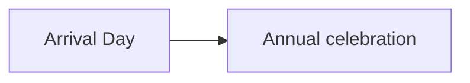

# Markdown in Writer's Vault

Notes support standard Markdown plus the extensions below. The same renderer is used for current notes and saved historical pages. Everything needed for formatting, math, code highlighting, and diagrams ships with the viewer.

[toc]

## Paragraphs and headings

Leave a blank line between paragraphs. Wrapping a paragraph across source lines keeps it as one paragraph. For an intentional line break, end a line with two spaces or a backslash.

Use `# Heading` through `###### Heading` for six heading levels. Underlining a title with `===` or `---` also works. Headings receive anchors automatically: `[Jump to examples](#examples)`. Use `## Examples {#examples}` to choose an explicit anchor. Links stay within their own note, even when several notes have the same heading.

Place `[toc]` or `[[toc]]` on its own line for a table of contents.

## Text formatting

| Syntax | Result |
| --- | --- |
| `**bold**` or `__bold__` | **bold** |
| `*italic*` or `_italic_` | *italic* |
| `**bold and _italic_**` | **bold and _italic_** |
| `~~removed~~` | ~~removed~~ |
| `==highlighted==` | ==highlighted== |
| `++inserted++` | ++inserted++ |
| `H~2~O` | H~2~O |
| `x^2^` | x^2^ |
| `:sparkles:` | :sparkles: |

Backticks produce inline code. Use a longer run of backticks if the code itself contains backticks. Backslash escapes and HTML entities work. Punctuation is preserved: the viewer does not automatically rewrite straight quotes or dashes.

## Lists and quotations

```markdown
1. First event
   - Supporting detail
     - Nested detail
2. Second event

- [x] Reviewed
- [ ] Still to resolve

> A quotation.
>
> > A quotation within it.
```

Lists can contain paragraphs, quotes, code, and nested lists. Task boxes display the state written in the note; checking them in the viewer does not edit the database. `---`, `***`, or `___` on a separate line makes a horizontal rule.

## Links and images

```markdown
[Website](https://example.com "Optional title")
[Reference-style link][source]

[source]: https://example.com

[Character](vault-record:character:example~ABCDEFGH)
[Historical character](vault-record:character:example~ABCDEFGH?v=2)
{width=200px}
{width=50%}
{width=200px}
```

Use the actual reference copied from the Vault; the references above are examples. Vault links open the existing record or image viewer, including pinned revisions. Descriptions can be long and remain available to screen readers. Pixel widths from 1–2048 and percentages from 1–100 are accepted; images also shrink to fit their container. Height attributes are supported when explicitly supplied.

HTTP(S) links, email links, automatic URL detection, angle-bracket links, reference-style links/images, and optional titles are supported. External images load from their supplied HTTP(S) addresses without a referrer. Vault images stay within the Vault. Relative filesystem paths are not Vault references.

## Tables

```markdown
| Book | Status | Chapters |
| :--- | :---: | ---: |
| First book | **Draft** | 12 |
| Second book | Planning | 8 |
```

Colons select left, center, or right alignment. Cells support formatting, links, images, and math. Escape a literal pipe as `\|`, including inside inline code. Tables scroll horizontally when needed.

Advanced tables also support captions, merged cells, and multiline contents:

```markdown
| Group || Count |
| --- | --- | --- |
| Two columns || 2 |
[A table caption]

| Character | Location |
| --- | --- |
| Aurora | Home |
| ^^ | Garden |
```

An adjacent extra `|` merges columns; `^^` merges a cell with the row above. A trailing backslash joins table source lines, allowing lists or other block content in a cell. A delimiter row followed by data can form a headerless table. A blank line separates independent tables.

## Footnotes, abbreviations, and definitions

```markdown
A claim with a footnote.[^source]
An inline footnote is also possible.^[This is the footnote text.]

[^source]: A longer explanation with **formatting**.

*[MCP]: Model Context Protocol

MCP connects the Vault.

Continuity
: A shared story world.

Canon
: Established facts within that world.
```

Footnote numbers and return links work independently in each note. Abbreviations expose their expanded form on hover.

## Callouts and collapsible sections

GitHub-style callouts support `NOTE`, `TIP`, `IMPORTANT`, `WARNING`, and `CAUTION`:

```markdown
> [!NOTE]
> This date is provisional.

::: warning Continuity conflict
Check the dates before using this scene.
:::

::: details Spoiler: reveal the ending
The **formatted** explanation goes here.
:::
```

Fenced containers support `note`, `tip`, `important`, `warning`, `caution`, `details`, and `spoiler`. Nested containers can use longer colon fences for the outer block.

> [!TIP]
> Put spoilers in a `details` or `spoiler` container so they start collapsed.

## Code

Use triple backticks or tildes for code blocks. An optional language name selects syntax highlighting, for example `javascript`, `python`, `csharp`, `rust`, `sql`, or `powershell`. All languages included with Highlight.js are bundled. Unknown language names display plain code. Indented code blocks also work.

````markdown
```javascript
const anniversary = 'September 23';
```
````

## Mathematics

KaTeX renders inline and display mathematics with an accessible MathML representation.

```markdown
Inline: $E=mc^2$ or \(E=mc^2\).

$$
\frac{1}{2} + \sqrt{4} = \frac{5}{2}
$$
```

Display math also supports `\[ ... \]`, LaTeX `\begin{...}` environments, and fenced `math` or `latex` blocks. Escape a literal dollar sign as `\$` when it could be mistaken for math. Math is limited to KaTeX's supported TeX commands; it does not run arbitrary LaTeX packages or commands.

$$
\frac{1}{2} + \sqrt{4} = \frac{5}{2}
$$

## Diagrams

Use a fenced `mermaid` block. The diagram renderer loads locally only when a note needs it. Mermaid supports flowcharts, sequence diagrams, state diagrams, class diagrams, entity relationships, timelines, Gantt charts, mind maps, pie charts, and other Mermaid diagram types.

````markdown

````


Each diagram has an expandable source section. Invalid diagrams retain their source and leave the rest of the note readable. Diagrams have limits of 100,000 source characters and 1,000 edges to keep the viewer responsive.

## Safe HTML and attributes

Basic HTML such as `<br>`, `<details>`, `<summary>`, `<kbd>`, `<sup>`, `<sub>`, `<mark>`, `<ruby>`, and HTML tables is supported. As with standard Markdown, block HTML generally needs a blank line before subsequent Markdown.

Attributes can be attached with `{#anchor .class title="A title"}`. Images additionally accept `width` and `height`. Custom classes only affect appearance when a corresponding viewer style exists.

Scripts, event handlers, arbitrary stylesheets, embedded frames, forms, executable code, and unsafe URL schemes are removed. Mermaid uses strict mode with click actions disabled. These are intentional boundaries, rather than missing Markdown syntax.

## Compatibility

This is CommonMark-based Markdown with the documented extensions, not every incompatible Markdown dialect. Obsidian `[[wikilinks]]`, transclusions, filesystem includes, executable notebooks, and server-rendered PlantUML are not interpreted. Use Vault record links and Mermaid for those supported use cases.

Existing note text is unchanged. Standard paragraph wrapping, heading levels, and nested formatting can look different from the old line-by-line renderer. The previous arbitrary per-note limits of 24 images and 50 Vault links have been removed.
