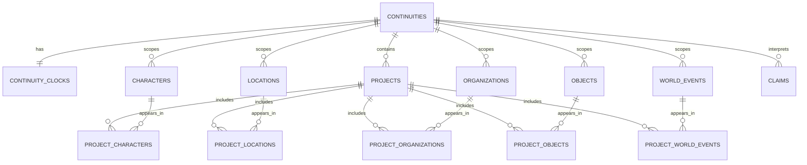
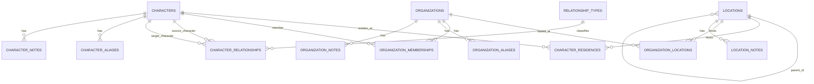
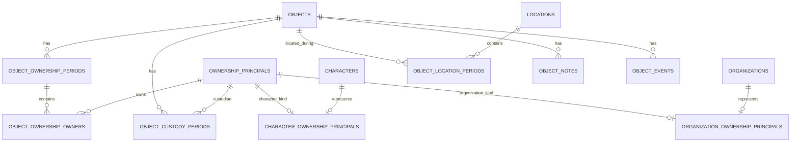
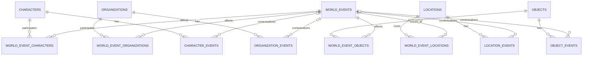
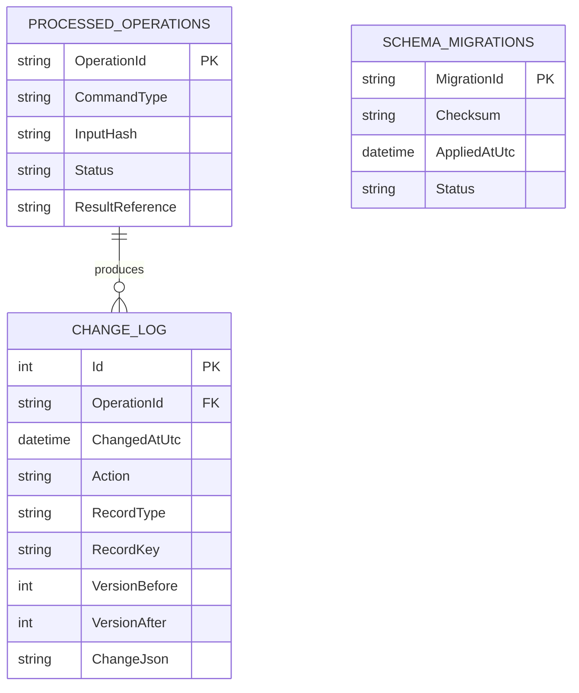

# Writing Vault v2 Logical Data Model

Status: Implemented and production-verified through Phase 10  
Physical DDL status: Implemented by the ordered Access schema migrations  
Decision source: `DESIGN_DECISIONS.md`

## Purpose

This model describes the implemented continuity, temporal, ownership, provenance, versioning, and recovery design.

The diagrams are logical. The implemented Access schema uses shared `CanonEntities`, `EntityNotes`, `EntityEvents`, `EntityTags`, `EntitySources`, and `ProjectEntities` tables where one enforced foreign key safely serves every canon subtype.

## Common record shapes

Mutable primary records use:

```text
Id                  AutoNumber, PK
CreatedAtUtc        Date/Time, required
UpdatedAtUtc        Date/Time, required
Version             Long, required, starts at 1
IsDeleted           Yes/No, required, default false
DeletedAtUtc        Date/Time, optional
DeletedOperationId  Short Text(36), optional
```

Continuity-owned records also contain a required `ContinuityId` foreign key. Soft-deletion columns are omitted from pure junctions whose removal is already represented in the change log.

Every conditional update includes `Id` and `Version` in its `WHERE` clause and increments `Version` atomically.

## Embedded fictional temporal value

Fictional dates are provider-free value objects represented by a repeated column family. A field named `Birth` maps conceptually to:

```text
BirthKind               Short Text(30), required
BirthLowerBound         Date/Time, optional
BirthUpperBound         Date/Time, optional
BirthLowerInclusive     Yes/No, optional
BirthUpperInclusive     Yes/No, optional
BirthOriginalText       Long Text, optional
BirthCalendarId         Short Text(50), required, default "Gregorian"
```

`Kind` controls which bounds are legal. Bounds are timezone-free fictional values. The application exposes them as one structured `StoryDate` or `StoryInterval`; callers never manipulate the storage columns independently.

This column family is used for births, deaths, events, relationships, memberships, residence, ownership, custody, and object-location periods.

## Continuity and project boundary



### Principal tables

- `Continuities`: name, description, default timezone, audit/version/deletion state.
- `ContinuityClocks`: one row per continuity containing `CurrentInstantUtc`, `ReferenceTimeZoneId`, `UpdatedAtUtc`, and `Version`.
- `Projects`: required continuity, name, description, audit/version/deletion state.
- `VariantGroups`: optional continuity-scoped identities used to group alternate records of one entity type without sharing their mutable facts.

Projects are deliberately flat work containers. Their name and description identify a series, novel, story, edition, or other writing unit; project nesting is rejected until a concrete workflow requires it. Assignments carry optional role and notes.

Every project assignment is checked so the project and assigned canon record share a continuity. Sources are vault-global and link to entities, notes, claims/evidence, snapshots, and tags; they are intentionally not direct project members.

## Characters, locations, organizations, and relationships



### Character identity

- `Characters` retains flexible identity and descriptive text.
- Birth and death use structured fictional dates.
- `BirthLocationId` replaces free-text birthplace; optional clarification text may preserve an imprecise or historical place label.
- Static `CurrentResidence` is removed.
- `CharacterResidences` stores location and a fictional interval, with optional primary/status and notes.
- `CharacterAliases` remains separate from preferred name.
- Aliases are unique per owner after whitespace and case normalization; different owners may share an alias.
- Preferred entity display names may repeat. They are descriptive data rather than public identity, and MCP-facing references must resolve ambiguity without exposing numeric database keys.

### Locations and timezone inheritance

- `Locations` has a required continuity and nullable parent in the same continuity.
- `TimeZoneId` is optional and uses a validated IANA identifier.
- A location without a timezone inherits the nearest ancestor timezone.
- Parent changes are transactionally checked for self-parenting and multi-level cycles.

### Organizations

- `Organizations` has notes, aliases, events, tags, sources, projects, and location history.
- `OrganizationMemberships` contains character, organization, role, structured fictional interval, notes, audit data, and version.
- Repeated non-overlapping memberships allow departure and later rejoining.
- Memberships for the same character, organization, and normalized role cannot overlap. Different roles may overlap.
- Organization-to-organization hierarchy is deferred; the current scope covers aliases, members, locations, notes, events, tags, sources, projects, and world-event participation.

### Character relationships

- `RelationshipTypes` defines name, direction, optional inverse name, and allowed-overlap policy.
- `CharacterRelationships` has source, target, type, structured interval, notes, audit/version/deletion state, and continuity.
- Undirected records store the lower character ID first.
- All linked records must share a continuity.

## Objects, ownership, custody, and location



### Ownership principals

- `OwnershipPrincipals`: continuity, kind (`Character`, `Organization`, `External`), stable label, audit/version/deletion state.
- `CharacterOwnershipPrincipals`: one-to-one principal-to-character mapping.
- `OrganizationOwnershipPrincipals`: one-to-one principal-to-organization mapping.
- External principals use the label on the principal and have no subtype row.

### Ownership periods

- `ObjectOwnershipPeriods`: object, state (`Owned`, `Unknown`, `Unowned`), structured interval, notes, audit/version/deletion state.
- `ObjectOwnershipOwners`: period, principal, optional share, and notes.
- Exactly one ownership period may be active for an object at an instant.
- A known-owner period has one or more owner rows.
- Unknown-owner and unowned periods have no owner rows.
- One owner row is the ordinary case; multiple rows are co-ownership.
- Shares are either absent for every owner or present for every owner and total 100 percent.
- A composition change normally closes one period and opens another.

### Separate concepts

- `ObjectCustodyPeriods` records possession without changing legal ownership.
- `ObjectLocationPeriods` records physical location and supplies timezone context.
- Ownership, custody, and location histories may have different boundaries.

## World events and entity events



- World events own the shared title, description, structured fictional date, continuity, and audit/version/deletion state.
- World events may have several locations; one may be marked primary.
- Participant rows attach characters, organizations, or objects and store role, impact, outcome, and notes. Locations use the separate event-location relation.
- Entity-specific events belong to characters, locations, organizations, or objects and may stand alone or reference one world event.
- When linked, an entity event adds local context rather than copying the world event's canonical title/date/description.

## Sources, snapshots, claims, and tags

```mermaid
erDiagram
    SOURCES ||--o{ SOURCE_SNAPSHOTS : captured_as
    SOURCES ||--o{ CLAIM_SOURCES : supports
    SOURCE_SNAPSHOTS o|--o{ CLAIM_SOURCES : observed_in
    CLAIMS ||--o{ CLAIM_SOURCES : evidenced_by

    CLAIMS ||--o{ CLAIM_CHARACTERS : concerns
    CHARACTERS ||--o{ CLAIM_CHARACTERS : subject
    CLAIMS ||--o{ CLAIM_LOCATIONS : concerns
    LOCATIONS ||--o{ CLAIM_LOCATIONS : subject
    CLAIMS ||--o{ CLAIM_ORGANIZATIONS : concerns
    ORGANIZATIONS ||--o{ CLAIM_ORGANIZATIONS : subject
    CLAIMS ||--o{ CLAIM_OBJECTS : concerns
    OBJECTS ||--o{ CLAIM_OBJECTS : subject
    CLAIMS ||--o{ CLAIM_WORLD_EVENTS : concerns
    WORLD_EVENTS ||--o{ CLAIM_WORLD_EVENTS : subject
    CLAIMS ||--o{ CLAIM_RELATIONSHIPS : concerns
    CHARACTER_RELATIONSHIPS ||--o{ CLAIM_RELATIONSHIPS : subject

    TAGS ||--o{ CHARACTER_TAGS : classifies
    TAGS ||--o{ LOCATION_TAGS : classifies
    TAGS ||--o{ ORGANIZATION_TAGS : classifies
    TAGS ||--o{ OBJECT_TAGS : classifies
    TAGS ||--o{ WORLD_EVENT_TAGS : classifies
    TAGS ||--o{ PROJECT_TAGS : classifies
    TAGS ||--o{ SOURCE_TAGS : classifies
```



### Sources and snapshots

- `Sources` is vault-global and retains canonical URL, alternate/archive URL, title, author/publisher, source type, citation, notes, retrieval status, and audit/version/deletion state.
- `SourceSnapshots` stores source, retrieval UTC time, media type, byte size, SHA-256 hash, relative cache path, and extraction status.
- Snapshot payloads live in the configured content-addressed cache directory, not inside Access.
- Refresh is explicit; ordinary reads perform no network access.

### Claims

- `Claims` is continuity-scoped and stores local claim text, confidence/status, commentary, optional target field, and audit/version/deletion state.
- `ClaimSources` records source, optional exact snapshot, locator, relationship (`Supports`, `Contradicts`, or `Context`), and a short excerpt or writer summary.
- Explicit claim-target junctions preserve foreign-key integrity.
- Entity-source junctions may also provide a broad “relevant to” link without asserting a particular claim.

### Tags

- `Tags` is vault-global.
- `NormalizedName` has a unique index and remains reserved while the tag is soft-deleted.
- Every tag junction has foreign keys to both its target and `Tags`.
- Organizations receive tag support in v2.

## Notes and direct source links

`EntityNotes` has one enforced foreign key to `CanonEntities`, so characters, locations, organizations, objects, projects, and world events all receive the same versioned note behavior without polymorphic IDs. Each note has body, optional title, audit/version/deletion state, and a required owner. `NoteSources` attaches sources and locators. Claims can target the owning canon entity when assertion-level provenance is required.

## Operational model



- `SchemaMigrations` governs DDL and checksum verification.
- `ProcessedOperations` supplies write idempotency. Reuse with a different input hash is rejected.
- `ChangeLog` is append-only audit history, not event sourcing.
- Generic record references in the historical log deliberately survive deletion and purge; they are not canonical relationships.
- Backup manifests remain external files because they describe copies of the entire database.

## Association capability matrix

| Entity | Continuity | Projects | Notes | Entity events | World-event participation | Tags | Sources/claims |
|---|---:|---:|---:|---:|---:|---:|---:|
| Character | Required | Yes | Yes | Yes | Yes | Yes | Yes |
| Location | Required | Yes | Yes | Yes | Yes | Yes | Yes |
| Organization | Required | Yes | Yes | Yes | Yes | Yes | Yes |
| Object | Required | Yes | Yes | Yes | Yes | Yes | Yes |
| World event | Required | Yes | Yes | N/A | N/A | Yes | Yes |
| Project | Required | N/A | Yes | No | No | Yes | Yes |
| Source | Vault-global | Yes | Built-in notes | No | Via claims | Yes | N/A |
| Claim | Required | Through target | Built-in commentary | No | May target event | Optional later | Required source link when evidence-backed |

## Required invariants

1. Canon relationships never cross continuity boundaries.
2. No normal write bypasses version checks, idempotency, validation, change logging, or transactions.
3. Location hierarchies are acyclic.
4. Ownership periods for one object do not overlap; co-owners belong to one shared period.
5. Residence, membership, custody, and location intervals obey their approved overlap policies.
6. Every pure junction has a composite primary key and enforced foreign keys.
7. Every mutable row has required audit values and a positive version.
8. Soft-deleted records are hidden by default but remain directly discoverable and restorable.
9. Story dates never silently acquire the machine timezone.
10. Entity-local current time reports the timezone and resolution source used.
11. Cached source content is verified by hash; locally stored claims remain readable without it.
12. Reads never perform DDL or implicit network retrieval.

## Review result

This model is implemented by the governed v2 baseline in `AccessSchemaDefinition.cs`; the schema verifier checks its exact physical tables, columns, indexes, constraints, and foreign keys before the server exposes tools.
